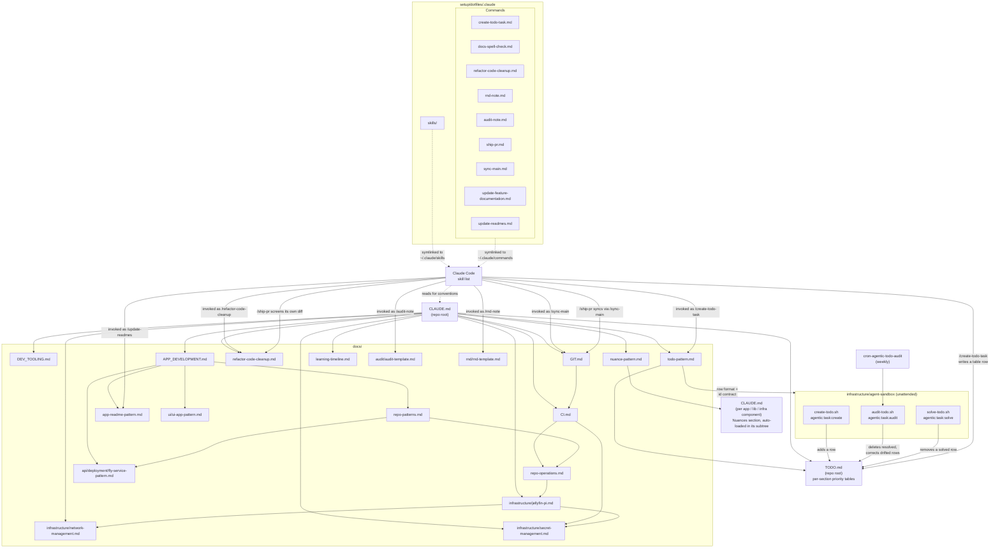

# CLAUDE

## Table of Contents

- [Doc Map](#doc-map)
- [Agent Context Map](#agent-context-map)
  - [How it fits together](#how-it-fits-together)
- [Coding Conventions](#coding-conventions)
- [Folder Structure](#folder-structure)

## Doc Map

- [Dev Tooling](./docs/DEV_TOOLING.md) — root `package.json` CLI scripts and cheatsheet; read first before adding or changing root scripts
- [CI](./docs/CI.md) — read first before touching workflows, monitoring, or IaC
  - GitHub Actions — action pinning, README badges, cron dispatch, workflow secrets
  - Upptime — status checks for deployed services
  - Terraform — IaC in `infrastructure/terraform/`
- [App Development](./docs/APP_DEVELOPMENT.md) — shared consts, env vars, auth, dependency pinning, npm publishing; read first before app work
  - [repo-patterns.md](./docs/repo-patterns.md) — decision map for adding/changing an app, workflow, or deploy: which existing pattern to copy
  - UI — [docs/ui/](./docs/ui/) (`ui-app-pattern.md`, `auth/*`, `deployment/*`)
  - API — [docs/api/](./docs/api/) (`deployment/fly-service-pattern.md`)
- [Git](./docs/GIT.md) — read first before committing or pushing
  - Concurrent Claude Sessions — `ListAgents` before branching, staging, committing, or stashing; the index, `HEAD`, and the stash are shared across sessions on one worktree
- [notes-pattern.md](./docs/notes-pattern.md) — read first before adding or editing files under `notes/`; per-topic conventions live under `docs/notes/`
- [learning-timeline.md](./docs/learning-timeline.md) — month-by-month record of what was being learned; extend the current month's row when work lands that introduces a new topic
- [network-management.md](./docs/infrastructure/network-management.md) — read first before changing DNS, domains, proxying, tunnels, or VPN
- [jellyfin-pi.md](./docs/infrastructure/jellyfin-pi.md) — the Ansible-provisioned homelab Pi running Jellyfin; read first before provisioning or changing hardware on the LAN (there is no Terraform for it)
- [secret-management.md](./docs/infrastructure/secret-management.md) — read first before adding a secret or a local `.env`/`.tfvars` file
- [nuance-pattern.md](./docs/nuance-pattern.md) — read first before recording a nuance or editing a directory-scoped `CLAUDE.md`; a nuance lives in the `## Nuances` section of the deepest directory it affects, and a repo-wide one in this file's own `## Nuances`
- [refactor-code-cleanup.md](./docs/refactor-code-cleanup.md) — cleanup checklist behind `/refactor-code-cleanup` and unattended `agentic:task:solve` runs
- [TODO.md](./TODO.md) — repo audit backlog
- [todo-pattern.md](./docs/todo-pattern.md) — read first before adding or editing a `TODO.md` row; single source for its format and the id contract the sandbox scripts parse
- Agent Context Map — this file
- Coding Conventions — this file
- Folder Structure — this file

## Agent Context Map

How the Doc Map above, `docs/`, and Claude Code skills/commands relate for an agent working in this repo.

### How it fits together

- **`CLAUDE.md`** is the entry point every agent reads first. Its Doc Map links out to the docs under `docs/` that own each topic (dev tooling, CI, app development, git, networking, secrets, nuance convention, cleanup checklist, TODO format) — including this map itself. It also points at two living records that agents keep current as work lands: `TODO.md` and `docs/learning-timeline.md`.
- **This map lives in the same file as the Doc Map it depicts**, so update the mermaid graph and bullets above in the same change whenever a Doc Map entry is added/removed, `docs/` gains or loses a doc, or skills/commands are rewired — there is no separate file to keep in sync.
- **Browse it rendered**: the GitHub Pages site's Claude Context page (`/#/claude-context` on `iamharryliu.github.io/vigilant-broccoli`, source `projects/nx-workspace/apps/ui/pages-index`) snapshots every file in this map at build time and renders the actual markdown link graph between them — file tree, search, and an Obsidian-style graph view. Which files it includes is configured in that app's `claude-context.snapshot.config.json`.
- **Nuances live with the code they trap**: a quirk is recorded in the `## Nuances` section of the `CLAUDE.md` at the deepest directory it affects (next to that component's `README.md`), because that is the file the agent harness loads on its own when work happens in that subtree — discovery costs nothing and needs no instruction to be followed, and the design carries over to any harness with the same convention under a different filename. A nuance spanning top-level directories goes in the repo-root `CLAUDE.md`'s own `## Nuances`, which is the same rule rather than an exception. There is no index: `grep -rl '^## Nuances' --include=CLAUDE.md .` derives the list, so nothing can drift out of sync. `docs/nuance-pattern.md` is the source of truth for scope, file shape, and entry shape; adding a nuance is two writes, both in the file you are already editing. `pages-index`'s snapshot picks up any `CLAUDE.md` in the repo with no config change.
- **`TODO.md` has four writers, and `docs/todo-pattern.md` governs all of them**: `/create-todo-task` interactively, and three unattended sandbox dispatches — `agentic:task:create` adds a row, `agentic:task:solve` removes one it has implemented, and `agentic:task:audit` (weekly, via `cron-agentic-todo-audit`) re-verifies the rows already there, deleting the resolved and correcting the drifted. Only the audit reads the backlog as a whole; it is the one that keeps rows from quietly citing files that have since moved. None of them may reissue a 6-hex id — that id is the handle `solve-todo*.sh` matches on, so the audit runner aborts its own commit if one disappears unexplained or changes.
- **`docs/`** is a graph, not a flat list: top-level docs (e.g. `APP_DEVELOPMENT.md`) route to more specific pattern docs (`repo-patterns.md`, `ui-app-pattern.md`, `fly-service-pattern.md`), which in turn cite each other for narrower concerns (secrets, deploy destinations).
- **Skills** (Claude Code commands) live as markdown files in `setup/dotfiles/.claude/commands/` and `setup/dotfiles/.claude/skills/`, symlinked into `~/.claude/commands` and `~/.claude/skills` by `setup/common/symlinks.sh`. Each command file opens with `description:` frontmatter (one sentence, shown in the skill picker) and `argument-hint:` when it takes arguments; the body is the instruction. `skills/` currently holds only a `.gitkeep` — every entry today is a command. They are a separate discovery mechanism from the Doc Map — Claude Code surfaces them as `/slash-commands` — but their instructions explicitly point back into `CLAUDE.md` and `docs/` (e.g. `/create-todo-task` follows `docs/todo-pattern.md` — the single source for the `TODO.md` row format, also parsed by `infrastructure/agent-sandbox/solve-todo*.sh` — and writes a priority-ordered row into the relevant section table, `/update-readmes` follows `docs/app-readme-pattern.md`, `/audit-note` and `/rnd-note` treat their `docs/audit`/`docs/rnd` templates as the source of truth for note structure, `/sync-main` and `/ship-pr` implement the merge-don't-rebase sync policy documented in `GIT.md`, and both `/refactor-code-cleanup` and `/ship-pr`'s pre-staging diff review apply `docs/refactor-code-cleanup.md`, which in turn defers to `CLAUDE.md`'s comment rule).

## Coding Conventions

- Prefer functional programming patterns over OOP.
- Avoid excessive try/catch blocks; only add error handling when explicitly needed.
- Avoid string literals, prefer having consts.
- Do not write tests unless explicitly asked.
- Comments have to earn their place. Write one only when it says something the code cannot: why a non-obvious approach was chosen, an external constraint or API quirk, a gotcha, or a worked example. Never add one that restates the next line (`// Get the last part after slash`), labels a block with its own code's words (`// Helper function to ...`, `// Start a single container`), or explains a self-describing config flag (`agentRules: false`) — that rationale goes in the commit message or the relevant `docs/` page, not the file. Two exceptions: keep a comment that is the sole body of an otherwise-empty block (an intentional empty `catch`), and leave `TODO`/`FIXME`/lint-directive comments alone. Generator scaffolding (`// Add more Next.js plugins to this list if needed.`) is noise — delete it when you touch the file.
- If a PR touches files for a cloud service, or introduces/changes usage of one, add or update a `## Free Tier` section in that service's notes/docs file documenting its free tier limits (e.g. [github-actions.md](./notes/tech/software/web-dev/devops/automation/github-actions.md)).
- Before working on an app or directory, check its `README.md` for an `## Agent Context` section and follow any upkeep instructions it lists (e.g. keeping a Page Navigation section in sync with the routes).
- A directory that records non-obvious traps carries them as a `## Nuances` section of its own `CLAUDE.md` — the file the agent harness loads automatically when you work in that subtree. Read the entry covering the surface you are about to touch before writing the code, not after something breaks. `grep -rl '^## Nuances' --include=CLAUDE.md .` lists every directory that has one.

## Folder Structure

- [Docs](./docs/) - Repo documentation.
- [Notes](./notes/) - Collection of markdown notes linked with relative file paths — see [notes-pattern.md](./docs/notes-pattern.md).
- [Setup](./setup/) - Machine setup scripts and dotfiles.
  - [dotfiles](./setup/dotfiles/) - Shell configs, aliases, and scripts (symlinked to `$HOME`).
  - [mac](./setup/mac/) - macOS setup.
  - [linux](./setup/linux/) - Linux setup.
- [Projects](./projects/) - Software projects.
  - [nx-workspace](./projects/nx-workspace) - Nx workspace for Typescript projects.
  - [grind-75](./projects/grind-75) - Standalone Grind 75 algorithm practice in Go/Python/TypeScript; the Python tests run as a `.pre-commit-config.yaml` hook.
