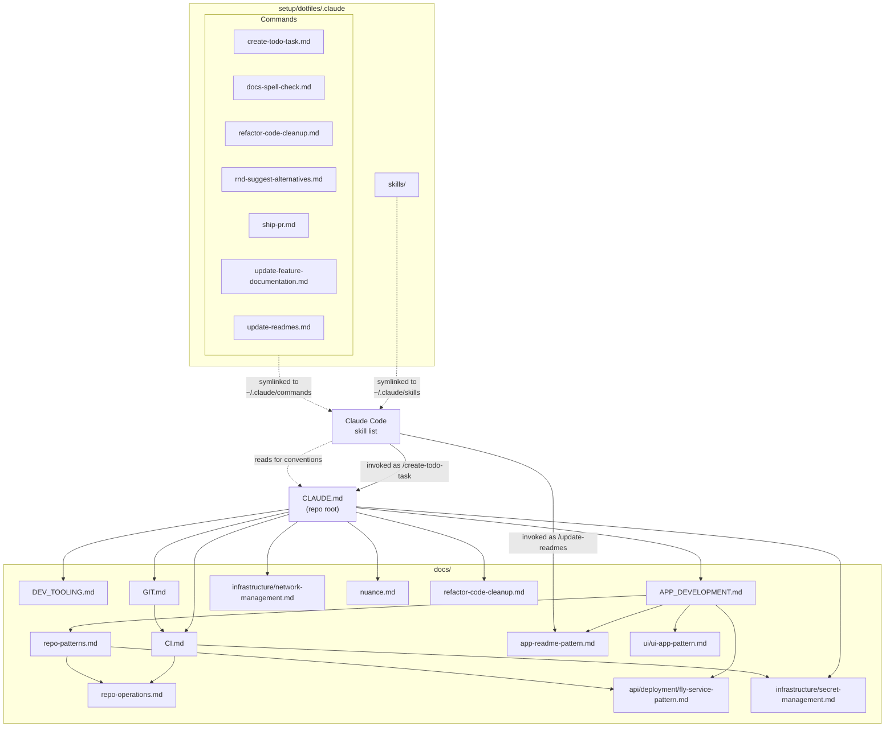

# Agent Context Map

How `CLAUDE.md`, `docs/`, and Claude Code skills/commands relate for an agent working in this repo.

## How it fits together

- **`CLAUDE.md`** is the entry point every agent reads first. Its Doc Map links out to the docs under `docs/` that own each topic (dev tooling, CI, app development, git, networking, secrets, nuances, cleanup checklist) — including this diagram itself.
- **This diagram is generated content, not source of truth** — `CLAUDE.md`'s Doc Map is authoritative. Whenever a Doc Map entry is added/removed, `docs/` gains or loses a doc, or skills/commands are rewired, update this file's mermaid graph and bullets to match in the same change.
- **`docs/`** is a graph, not a flat list: top-level docs (e.g. `APP_DEVELOPMENT.md`) route to more specific pattern docs (`repo-patterns.md`, `ui-app-pattern.md`, `fly-service-pattern.md`), which in turn cite each other for narrower concerns (secrets, deploy destinations).
- **Skills** (Claude Code commands) live as markdown files in `setup/dotfiles/.claude/commands/` and `setup/dotfiles/.claude/skills/`, symlinked into `~/.claude/commands` and `~/.claude/skills` by `setup/common/symlinks.sh`. They are a separate discovery mechanism from the Doc Map — Claude Code surfaces them as `/slash-commands` — but their instructions explicitly point back into `CLAUDE.md` and `docs/` (e.g. `/create-todo-task` reads `CLAUDE.md` for constraints, `/update-readmes` follows `docs/app-readme-pattern.md`).
