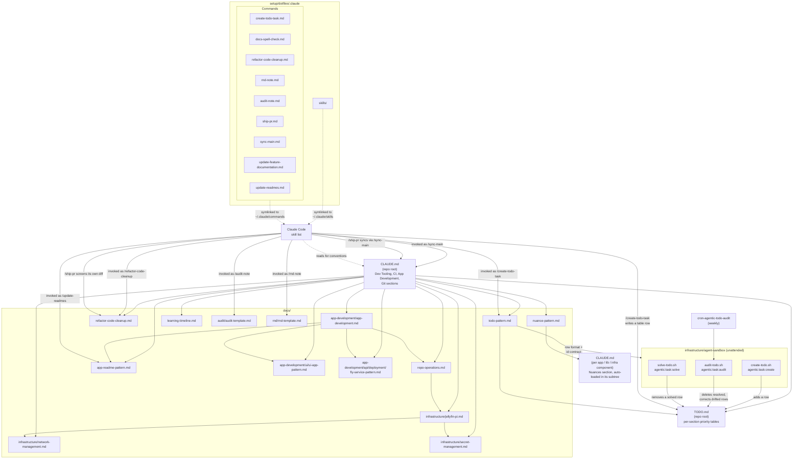

# Agent Context Map

How `CLAUDE.md`, `docs/`, and Claude Code skills/commands relate for an agent working in this repo.

```mermaid
flowchart TD
    CLAUDE["CLAUDE.md<br/>(repo root)<br/>Dev Tooling, CI, App Development,<br/>Git sections"]
    SCOPED_CLAUDE["CLAUDE.md<br/>(per app / lib / infra component)<br/>Nuances section, auto-loaded in its subtree"]
    TODO["TODO.md<br/>(repo root)<br/>per-section priority tables"]

    subgraph DOCS["docs/"]
        NETWORK["infrastructure/network-management.md"]
        JELLYFIN_PI["infrastructure/jellyfin-pi.md"]
        NUANCE_PATTERN["nuance-pattern.md"]
        APP_DEV["app-development/app-development.md"]
        REPO_OPS["repo-operations.md"]
        APP_README["app-readme-pattern.md"]
        UI_PATTERN["app-development/ui/ui-app-pattern.md"]
        FLY_PATTERN["app-development/api/deployment/<br/>fly-service-pattern.md"]
        SECRETS["infrastructure/secret-management.md"]
        REFACTOR["refactor-code-cleanup.md"]
        TODO_PATTERN["todo-pattern.md"]
        TIMELINE["learning-timeline.md"]
        AUDIT_TPL["audit/audit-template.md"]
        RND_TPL["rnd/rnd-template.md"]
    end

    CLAUDE --> NETWORK
    CLAUDE --> JELLYFIN_PI
    CLAUDE --> SECRETS
    CLAUDE --> NUANCE_PATTERN
    NUANCE_PATTERN --> SCOPED_CLAUDE
    CLAUDE --> REFACTOR
    CLAUDE --> TODO
    CLAUDE --> TODO_PATTERN
    TODO_PATTERN --> TODO
    CLAUDE --> TIMELINE
    CLAUDE --> REPO_OPS
    CLAUDE --> APP_DEV
    CLAUDE --> APP_README
    CLAUDE --> UI_PATTERN
    CLAUDE --> FLY_PATTERN

    APP_DEV --> FLY_PATTERN
    APP_DEV --> UI_PATTERN
    APP_DEV --> APP_README
    APP_DEV --> REPO_OPS
    REPO_OPS --> JELLYFIN_PI
    JELLYFIN_PI --> NETWORK
    JELLYFIN_PI --> SECRETS

    subgraph SKILLS["setup/dotfiles/.claude"]
        subgraph COMMANDS["Commands"]
            CMD_TODO["create-todo-task.md"]
            CMD_SPELLCHECK["docs-spell-check.md"]
            CMD_REFACTOR_CLEANUP["refactor-code-cleanup.md"]
            CMD_RND_NOTE["rnd-note.md"]
            CMD_AUDIT_NOTE["audit-note.md"]
            CMD_SHIP_PR["ship-pr.md"]
            CMD_SYNC_MAIN["sync-main.md"]
            CMD_UPDATE_FEATURE_DOCS["update-feature-documentation.md"]
            CMD_UPDATE_READMES["update-readmes.md"]
        end
        SKILLDIR["skills/"]
    end

    subgraph SANDBOX["infrastructure/agent-sandbox (unattended)"]
        CREATE_TODO["create-todo.sh<br/>agentic:task:create"]
        AUDIT_TODO["audit-todo.sh<br/>agentic:task:audit"]
        SOLVE_TODO["solve-todo.sh<br/>agentic:task:solve"]
    end

    CRON_AUDIT["cron-agentic-todo-audit<br/>(weekly)"] --> AUDIT_TODO
    CREATE_TODO -->|adds a row| TODO
    AUDIT_TODO -->|deletes resolved,<br/>corrects drifted rows| TODO
    SOLVE_TODO -->|removes a solved row| TODO
    TODO_PATTERN -->|row format +<br/>id contract| SANDBOX

    COMMANDS -.->|symlinked to<br/>~/.claude/commands| CLAUDECODE["Claude Code<br/>skill list"]
    SKILLDIR -.->|symlinked to<br/>~/.claude/skills| CLAUDECODE

    CLAUDECODE -->|invoked as /update-readmes| APP_README
    CLAUDECODE -->|invoked as /create-todo-task| TODO_PATTERN
    CLAUDECODE -->|/create-todo-task<br/>writes a table row| TODO
    CLAUDECODE -->|invoked as /sync-main| CLAUDE
    CLAUDECODE -->|/ship-pr syncs via /sync-main| CLAUDE
    CLAUDECODE -->|invoked as /refactor-code-cleanup| REFACTOR
    CLAUDECODE -->|/ship-pr screens its own diff| REFACTOR
    CLAUDECODE -->|invoked as /audit-note| AUDIT_TPL
    CLAUDECODE -->|invoked as /rnd-note| RND_TPL
    CLAUDECODE -.->|reads for conventions| CLAUDE
```

## How it fits together

- **`CLAUDE.md`** is the entry point every agent reads first. Dev Tooling, CI, App Development, and Git live as sections in the file itself rather than as separate docs — see its own Doc Map. Its Doc Map also links out to the more specific docs under `docs/` (networking, secrets, nuance convention, cleanup checklist, TODO format) — including this diagram itself. It also points at two living records that agents keep current as work lands: `TODO.md` and `docs/learning-timeline.md`.
- **This diagram is generated content, not source of truth** — `CLAUDE.md`'s Doc Map is authoritative. Whenever a Doc Map entry is added/removed, `docs/` gains or loses a doc, a section is folded into or split out of `CLAUDE.md`, or skills/commands are rewired, update this file's mermaid graph and bullets to match in the same change.
- **Browse it rendered**: the GitHub Pages site's Claude Context page (`/#/claude-context` on `iamharryliu.github.io/vigilant-broccoli`, source `projects/nx-workspace/apps/ui/pages-index`) snapshots every file in this diagram at build time and renders the actual markdown link graph between them — file tree, search, and an Obsidian-style graph view. Which files it includes is configured in that app's `claude-context.snapshot.config.json`.
- **Nuances live with the code they trap**: a quirk is recorded in the `## Nuances` section of the `CLAUDE.md` at the deepest directory it affects (next to that component's `README.md`), because that is the file the agent harness loads on its own when work happens in that subtree — discovery costs nothing and needs no instruction to be followed, and the design carries over to any harness with the same convention under a different filename. A nuance spanning top-level directories goes in the repo-root `CLAUDE.md`'s own `## Nuances`, which is the same rule rather than an exception. There is no index: `grep -rl '^## Nuances' --include=CLAUDE.md .` derives the list, so nothing can drift out of sync. `docs/nuance-pattern.md` is the source of truth for scope, file shape, and entry shape; adding a nuance is two writes, both in the file you are already editing. `pages-index`'s snapshot picks up any `CLAUDE.md` in the repo with no config change.
- **`TODO.md` has four writers, and `docs/todo-pattern.md` governs all of them**: `/create-todo-task` interactively, and three unattended sandbox dispatches — `agentic:task:create` adds a row, `agentic:task:solve` removes one it has implemented, and `agentic:task:audit` (weekly, via `cron-agentic-todo-audit`) re-verifies the rows already there, deleting the resolved and correcting the drifted. Only the audit reads the backlog as a whole; it is the one that keeps rows from quietly citing files that have since moved. None of them may reissue a 6-hex id — that id is the handle `solve-todo*.sh` matches on, so the audit runner aborts its own commit if one disappears unexplained or changes.
- **`docs/`** is a graph, not a flat list: `CLAUDE.md` routes to more specific pattern docs (`app-development/app-development.md`, `ui-app-pattern.md`, `fly-service-pattern.md`), which in turn cite each other for narrower concerns (secrets, deploy destinations).
- **Skills** (Claude Code commands) live as markdown files in `setup/dotfiles/.claude/commands/` and `setup/dotfiles/.claude/skills/`, symlinked into `~/.claude/commands` and `~/.claude/skills` by `setup/common/symlinks.sh`. Each command file opens with `description:` frontmatter (one sentence, shown in the skill picker) and `argument-hint:` when it takes arguments; the body is the instruction. `skills/` currently holds only a `.gitkeep` — every entry today is a command. They are a separate discovery mechanism from the Doc Map — Claude Code surfaces them as `/slash-commands` — but their instructions explicitly point back into `CLAUDE.md` and `docs/` (e.g. `/create-todo-task` follows `docs/todo-pattern.md` — the single source for the `TODO.md` row format, also parsed by `infrastructure/agent-sandbox/solve-todo*.sh` — and writes a priority-ordered row into the relevant section table, `/update-readmes` follows `docs/app-readme-pattern.md`, `/audit-note` and `/rnd-note` treat their `docs/audit`/`docs/rnd` templates as the source of truth for note structure, `/sync-main` and `/ship-pr` implement the merge-don't-rebase sync policy documented in `CLAUDE.md`'s Git section, and both `/refactor-code-cleanup` and `/ship-pr`'s pre-staging diff review apply `docs/refactor-code-cleanup.md`, which in turn defers to `CLAUDE.md`'s comment rule).
