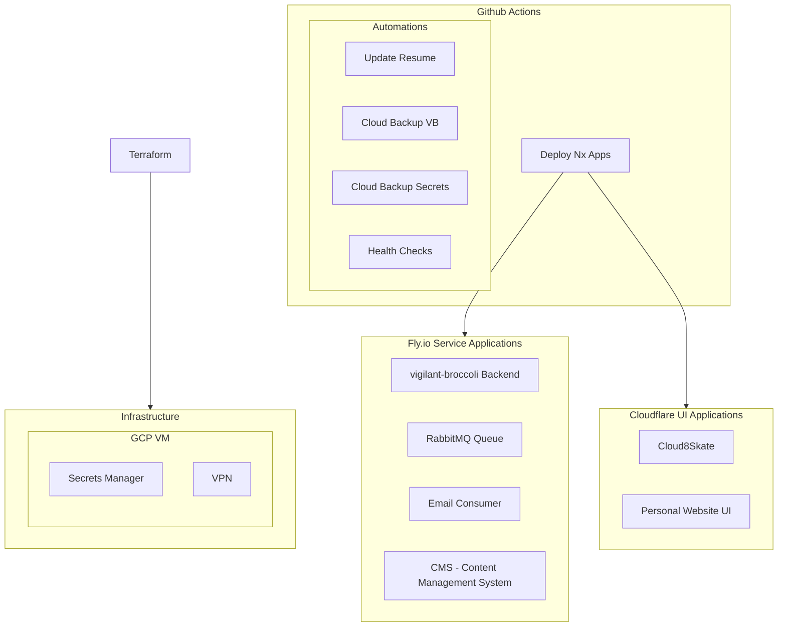
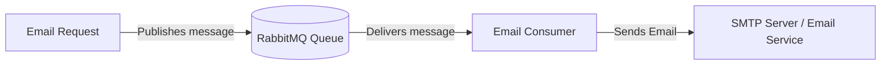

# Infrastructure

```mermaid
graph TD

%% Define nodes

TERRAFORM[Terraform]

subgraph INFRASTRUCTURE[Infrastructure]
  subgraph GCP_VM[GCP VM]
    SECRETS_MANAGER[Secrets Manager]
    VPN[VPN]
  end
end

subgraph GITHUB_ACTIONS[Github Actions]
  DEPLOY_NX_APPS[Deploy Nx Apps]
  subgraph AUTOMATIONS[Automations]
    UPDATE_RESUME[Update Resume]
    CLOUD_BACKUP_VB[Cloud Backup VB]
    CLOUD_BACKUP_SECRETS[Cloud Backup Secrets]
    HEALTH_CHECK[Health Checks]
  end
end

subgraph CLOUDFLARE_UI_APPS[Cloudflare UI Applications]
  CLOUD_8_SKATE[Cloud8Skate]
  PERSONAL_WEBSITE_UI[Personal Website UI]
end

subgraph FLYIO_SERVICE_APPS[Fly.io Service Applications]
  VB_BACKEND[vigilant-broccoli Backend]
  QUEUE[RabbitMQ Queue]
  EMAIL_CONSUMER[Email Consumer]
  CMS[CMS - Content Management System]
end


%% Connections
TERRAFORM-->INFRASTRUCTURE
DEPLOY_NX_APPS-->FLYIO_SERVICE_APPS
DEPLOY_NX_APPS-->CLOUDFLARE_UI_APPS

```

## RabbitMQ Email Consumer Architecture

```mermaid
graph LR
  A[Email Request] -->|Publishes message| B[(RabbitMQ Queue)]
  B -->|Delivers message| C[Email Consumer]
  C -->|Sends Email| D[SMTP Server / Email Service]
```
