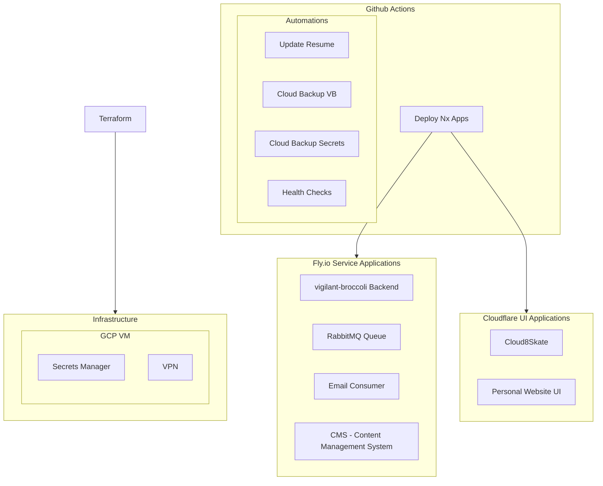
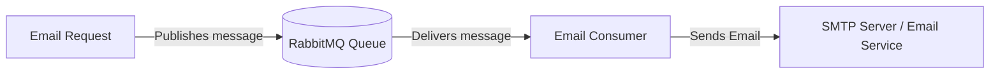
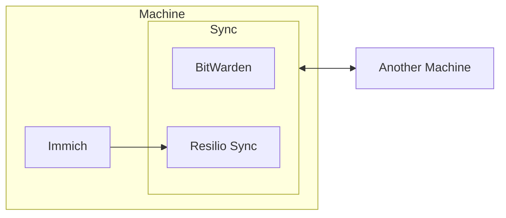

# Infrastructure

## RabbitMQ Email Consumer Architecture

## Organization Infrastructure

- Secret Manager
- VPN

## Personal Infrastructure

- Secrets - BitWarden
- Image Handler - Immich
- Machine Sync - Resilio Sync

