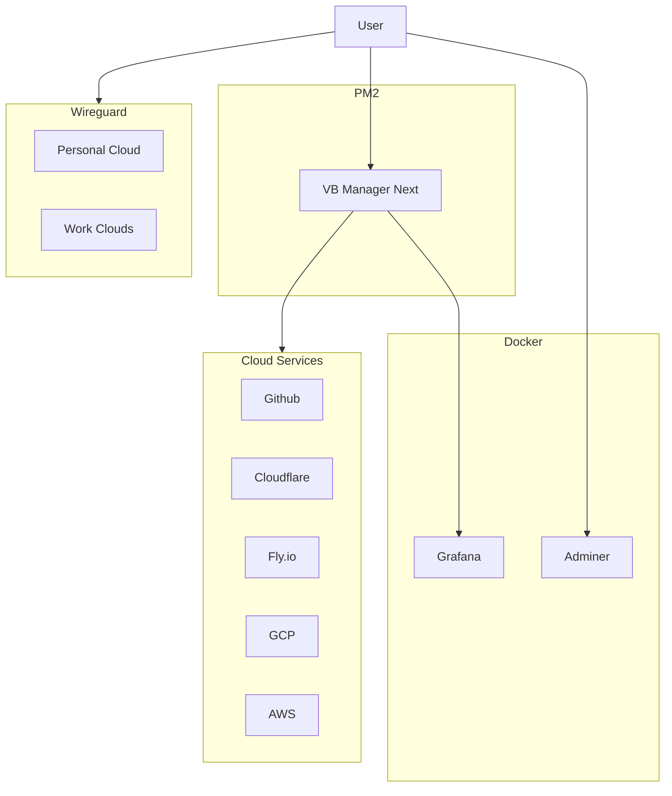
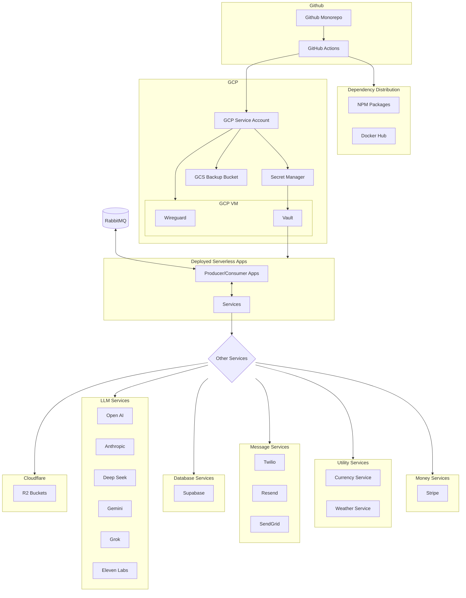
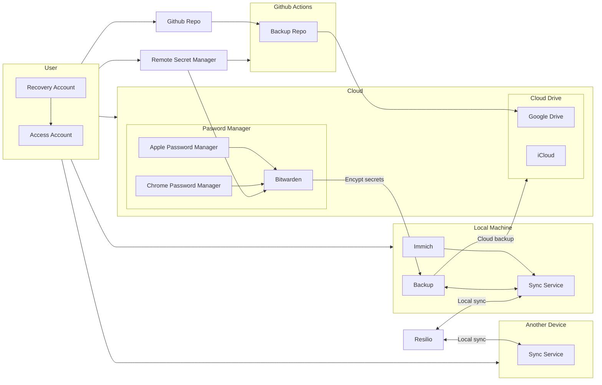
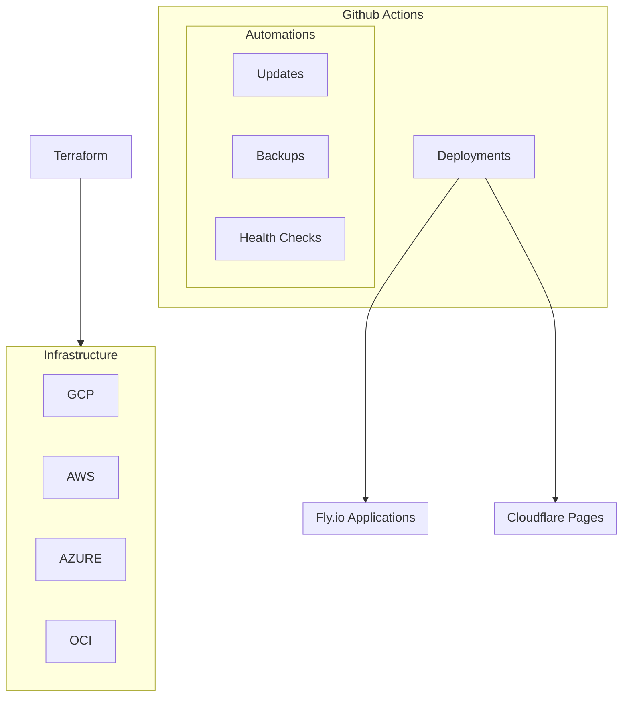
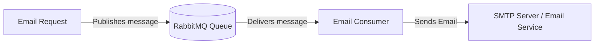

# Infrastructure

## Table of Contents

- [Local Infrastructure](#local-infrastructure)
- [Cloud Infrastructure](#cloud-infrastructure)
- [Personal Infrastructure](#personal-infrastructure)
- [Organization Infrastructure](#organization-infrastructure)

## Local Infrastructure

## Cloud Infrastructure

- [Github Repo](http://github.com/iamharryliu/vigilant-broccoli/)
  - [Github Actions](https://github.com/iamharryliu/vigilant-broccoli/actions)
- [NPM Packages](https://www.npmjs.com/settings/vigilant-broccoli/packages)
- [Docker Hub Repositories](https://hub.docker.com/repositories/iamharryliu)

## Personal Infrastructure

### Sync Services

- Resilio Sync - Local Device Sync
- Google Drive
- iCloud - iOS Sync

### Storage Services

- GCP Buckets
- Cloudflare Buckets

### Image Services

- Apple Photos - iOS Image/Video Sync
- Google Photos - Image/Video Backup
- Immich - Local Image/Video Sync

### Backups

### CI

### RabbitMQ Email Consumer Architecture

## Organization Infrastructure

- Secret Manager
- VPN
