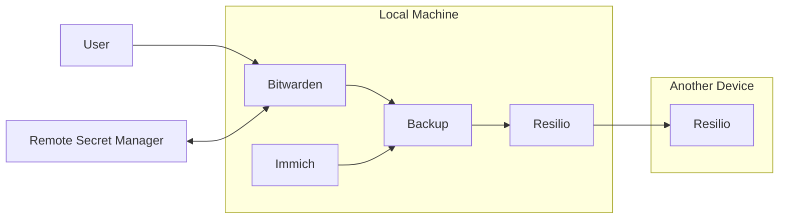
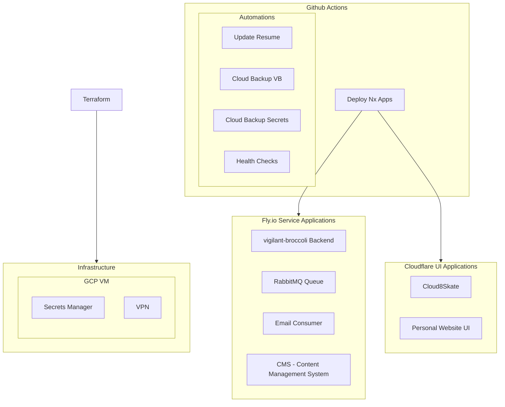
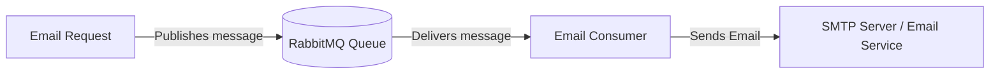

# Infrastructure

## Personal Infrastructure

### Secret Management

- Google Password Manager
- Bitwarden
- Hashicorp Vault

### Syncing Devices

- Cloud Services
- Resilio Sync

### Image Services

- Apple Photos
- Google Photos
- Immich

### Backups

### CI

### RabbitMQ Email Consumer Architecture

## Organization Infrastructure

- Secret Manager
- VPN
