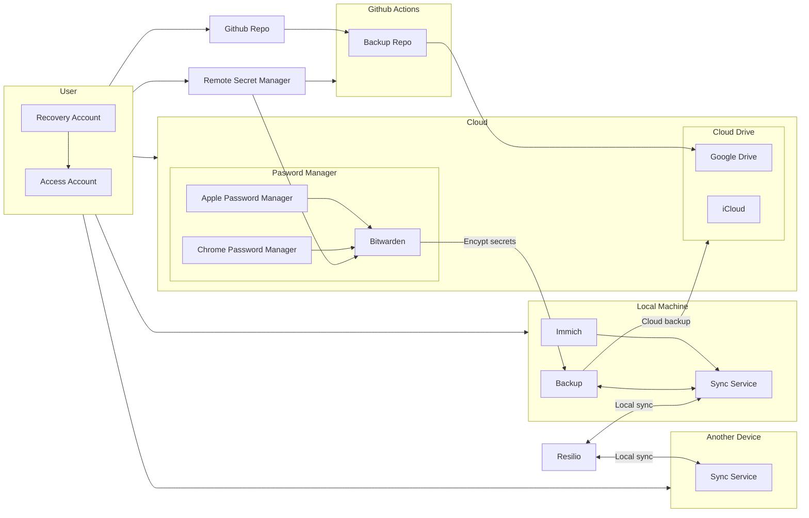
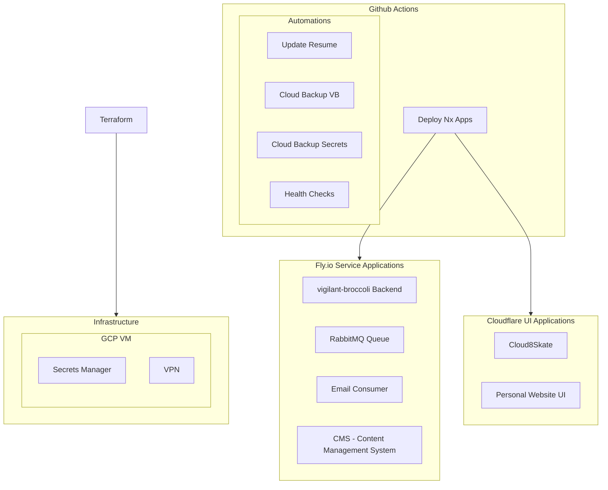
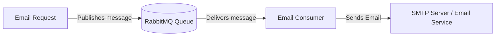

# Infrastructure

## Personal Infrastructure

### Secret Management

- Google Password Manager - Browser Password
- Apple Password Manager - iOS Passwords
- Hashicorp Vault - Application Secrets
- Bitwarden - Other and secret management backup point

### Sync Services

- Resilio Sync - Local Device Sync
- Google Drive
- iCloud - iOS Sync

### Storage Services

- GCP Buckets
- Cloudflare Buckets

### Image Services

- Apple Photos - iOS Image/Video Sync
- Google Photos - Image/Video Backup
- Immich - Local Image/Video Sync

### Backups

### CI

### RabbitMQ Email Consumer Architecture

## Organization Infrastructure

- Secret Manager
- VPN
