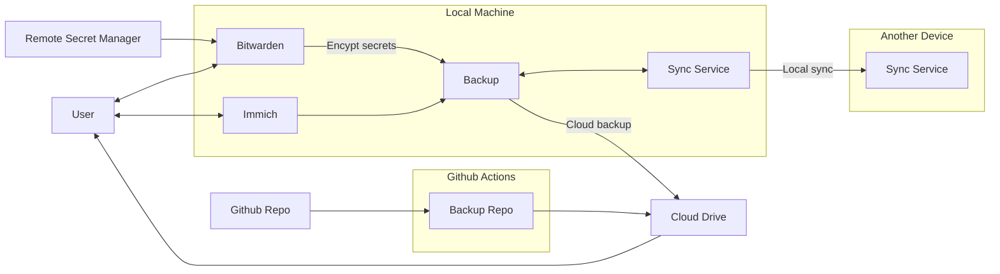
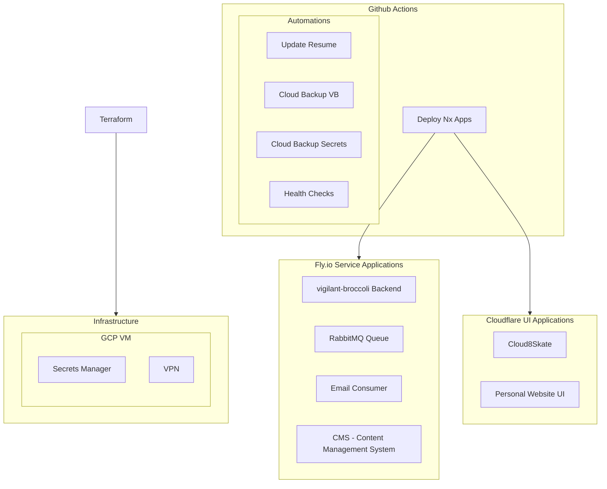
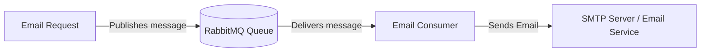

# Infrastructure

## Personal Infrastructure

### Secret Management

- Google Password Manager
- Bitwarden
- Hashicorp Vault

### Sync Services

- Google Drive
- Resilio Sync

### Storage Services

- GCS Buckets
- Cloudflare R2 Buckets

### Image Services

- Apple Photos
- Google Photos
- Immich

### Backups

### CI

### RabbitMQ Email Consumer Architecture

## Organization Infrastructure

- Secret Manager
- VPN
