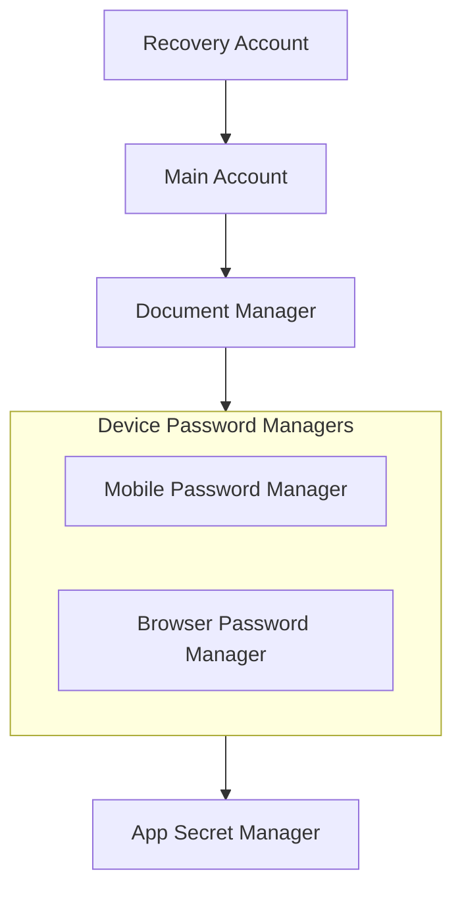

# Secret Management

## Secret Hierarchy



## Secret Rotation

- Rotate credentials semi-annually

### Bitwarden

1. Update GCP Secret Manager:
   ```bash
   gcloud secrets versions add BITWARDEN_PASSWORD --data-file=- <<< "your-bitwarden-password"
   ```

### Cloudflare

Rotate manually at

- [Cloudflare Account API Tokens](https://dash.cloudflare.com/26d066ec62c4d27b8da5e9aebac17293/api-tokens)
- [R2 Object Storage Tokens](https://dash.cloudflare.com/26d066ec62c4d27b8da5e9aebac17293/r2/api-tokens)

- `CLOUDFLARE_API_TOKEN_VB_DEPLOY_NX_APPS`
- `CLOUDFLARE_R2_ACCESS_KEY_ID`
- `CLOUDFLARE_R2_SECRET_ACCESS_KEY`
- `NX_CACHE_R2_ACCESS_KEY_ID` — bucket-scoped ("Object Read & Write" on `nx-cache`) R2 token for the Nx remote cache
- `NX_CACHE_R2_SECRET_ACCESS_KEY`

### Other

- Wireguard secrets
- Resilio secrets
