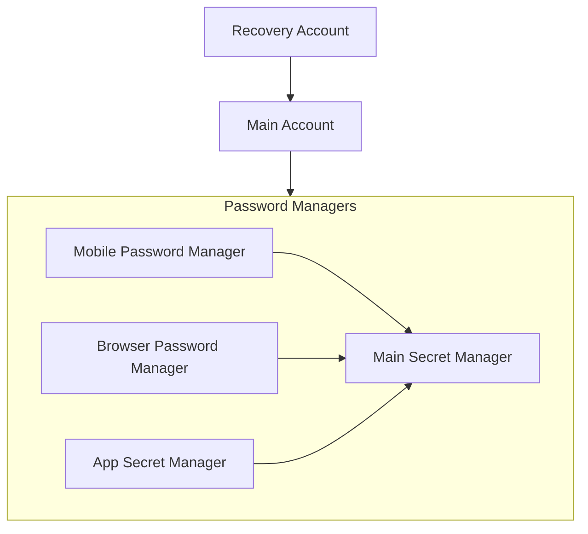

# Secret Management

## Secret Hierarchy



## Secret Rotation

- Rotate credentials semi-annually

### BITWARDEN_PASSWORD

1. Update GCP Secret Manager:
   ```bash
   gcloud secrets versions add BITWARDEN_PASSWORD --data-file=- <<< "your-bitwarden-password"
   ```

### FLY_API_TOKEN (Fly.io Token)

```bash
./terraform/packer/scripts/rotate-fly-token.sh
```

### Cloudflare Secrets

Rotate manually at

- [Cloudflare Account API Tokens](https://dash.cloudflare.com/26d066ec62c4d27b8da5e9aebac17293/api-tokens)
- [R2 Object Storage Tokens](https://dash.cloudflare.com/26d066ec62c4d27b8da5e9aebac17293/r2/api-tokens)

- `CLOUDFLARE_API_TOKEN_VB_DEPLOY_NX_APPS`
- `CLOUDFLARE_R2_ACCESS_KEY_ID`
- `CLOUDFLARE_R2_SECRET_ACCESS_KEY`
