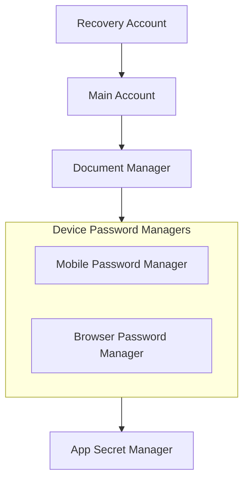

# Secret Management

## Secret Hierarchy



## Secret Rotation

- Rotate credentials semi-annually

### Bitwarden

1. Update GCP Secret Manager:
   ```bash
   gcloud secrets versions add BITWARDEN_PASSWORD --data-file=- <<< "your-bitwarden-password"
   ```

### Cloudflare

Rotate manually at

- [Cloudflare Account API Tokens](https://dash.cloudflare.com/26d066ec62c4d27b8da5e9aebac17293/api-tokens)
- [R2 Object Storage Tokens](https://dash.cloudflare.com/26d066ec62c4d27b8da5e9aebac17293/r2/api-tokens)

- `CLOUDFLARE_API_TOKEN_VB_DEPLOY_NX_APPS`
- `CLOUDFLARE_R2_ACCESS_KEY_ID`
- `CLOUDFLARE_R2_SECRET_ACCESS_KEY`

The R2 keys double as the Nx remote-cache credentials (`@nx/s3-cache`, `vigilant-broccoli-nx-cache` bucket) — the deploy jobs map them to `AWS_ACCESS_KEY_ID`/`AWS_SECRET_ACCESS_KEY`.

### Nx remote cache key

- `NX_KEY` — the free self-hosted-cache activation key from `npx nx register <email>` (run once in `projects/nx-workspace`). Store it in Vault at `kv/data/secrets`; without it the S3 cache is silently skipped and every deploy rebuilds from scratch. Not a rotating credential.

### Other

- Wireguard secrets
- Resilio secrets
