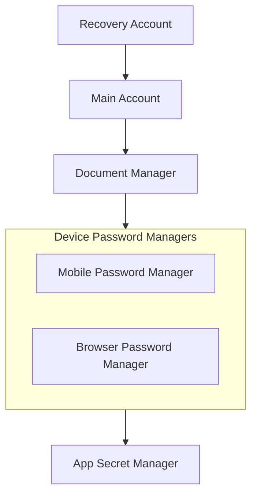

# Secret Management

## Secret Hierarchy


```mermaid
flowchart


RECOVERY_ACCOUNT[Recovery Account]
MAIN_ACCOUNT[Main Account]
DOCUMENT_MANAGER[Document Manager]
subgraph DEVICE_PASSWORD_MANAGERS[Device Password Managers]
  MOBILE_PASSWORD_MANAGER[Mobile Password Manager]
  BROWSER_PASSWORD_MANAGER[Browser Password Manager]
end
APP_SECRET_MANAGER[App Secret Manager]

RECOVERY_ACCOUNT-->MAIN_ACCOUNT-->DOCUMENT_MANAGER-->DEVICE_PASSWORD_MANAGERS-->APP_SECRET_MANAGER
```

## Secret Rotation

- Rotate credentials semi-annually

### Bitwarden

1. Update GCP Secret Manager:
   ```bash
   gcloud secrets versions add BITWARDEN_PASSWORD --data-file=- <<< "your-bitwarden-password"
   ```

### Cloudflare

Rotate manually at

- [Cloudflare Account API Tokens](https://dash.cloudflare.com/26d066ec62c4d27b8da5e9aebac17293/api-tokens)
- [R2 Object Storage Tokens](https://dash.cloudflare.com/26d066ec62c4d27b8da5e9aebac17293/r2/api-tokens)

- `CLOUDFLARE_API_TOKEN_VB_DEPLOY_NX_APPS`
- `CLOUDFLARE_R2_ACCESS_KEY_ID`
- `CLOUDFLARE_R2_SECRET_ACCESS_KEY`

### Nx cache

`NX_CACHE_WRITE_TOKEN` / `NX_CACHE_READ_TOKEN` are Terraform-minted (`random_password.nx_cache_write_token` / `nx_cache_read_token` in `cloudflare-nx-cache.tf`) and bound directly into the `nx-cache` Worker as its own bearer tokens — never a Cloudflare API/R2 credential. After `pnpm tf:apply`, sync manually:

```bash
vault kv patch kv/data/secrets \
  NX_CACHE_WRITE_TOKEN="$(terraform output -raw nx_cache_write_token)" \
  NX_CACHE_READ_TOKEN="$(terraform output -raw nx_cache_read_token)"
```

`NX_CACHE_WRITE_TOKEN` (GET/HEAD/PUT) goes only to `deploy.yml`; `NX_CACHE_READ_TOKEN` (GET/HEAD only — the Worker returns `403` on PUT) goes to `ci-pr-check.yml`. Rotate by tainting both `random_password` resources, `pnpm tf:apply`, then repeat the sync above.

### Other

- Wireguard secrets
- Resilio secrets
