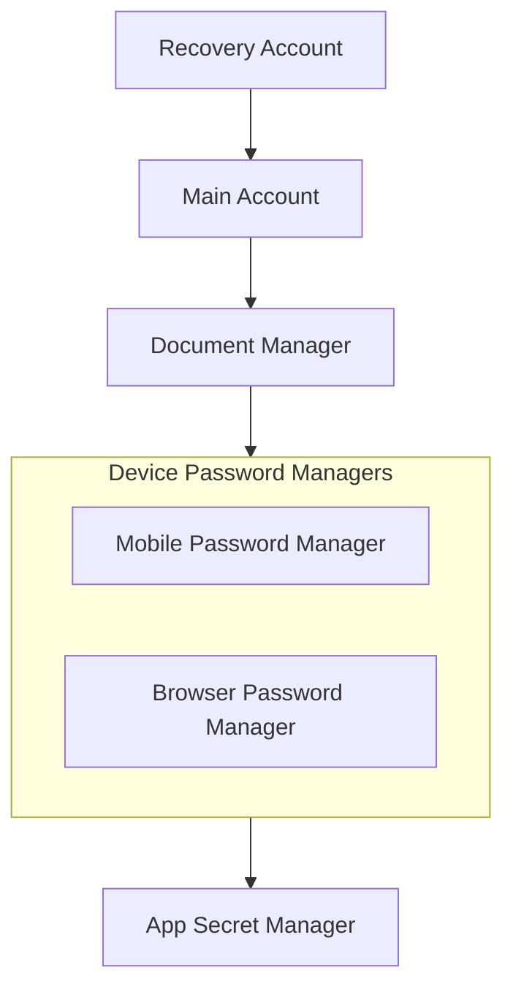

# Secret Management

## Local config files

- Secrets live in a secret manager, never checked into the repo: Vault (`kv/data/secrets`) and GCP Secret Manager (Tier 0, root of trust) are the sources of truth — see the hierarchy below.
- Do not hand-create local `.env` or `.tfvars` files holding real secret values; both are gitignored and every such file is a leak surface.
- Tooling generates them from the secret manager at run time instead:
  - Agent sandbox: `load-env-from-vault.sh` fetches Vault tokens and `export`s them straight into the current shell session — sourced (`. load-env-from-vault.sh`) or `eval "$(load-env-from-vault.sh)"` — never writing them to disk.
  - Terraform CLI env comes from `infrastructure/terraform/scripts/load-vault-tf-env.sh`.
  - Local scripts read the Vault token via `projects/nx-workspace/scripts/gcp-vault-token.ts`, with `NODE_EXTRA_CA_CERTS=./scripts/vault-ca.crt` for Vault's self-signed cert.
- Committed `*.env.example` files are fine — they list keys with no values and drive `deploy-flyio-secrets.ts`.
- Non-secret identifiers (account IDs, zone IDs, GitHub App IDs, domains) are not secrets: hardcode them as variable `default`s in `infrastructure/terraform/variables.tf` (e.g. `upptime_gh_app_id`, `cloudflare_account_id`, `cloudflare_zone_id`) rather than routing them through `.tfvars` or Vault. Only the matching secret half — a private key or token — goes to the secret manager.

## Secret Hierarchy


```mermaid
flowchart


RECOVERY_ACCOUNT[Recovery Account]
MAIN_ACCOUNT[Main Account]
DOCUMENT_MANAGER[Document Manager]
subgraph DEVICE_PASSWORD_MANAGERS[Device Password Managers]
  MOBILE_PASSWORD_MANAGER[Mobile Password Manager]
  BROWSER_PASSWORD_MANAGER[Browser Password Manager]
end
APP_SECRET_MANAGER[App Secret Manager]

RECOVERY_ACCOUNT-->MAIN_ACCOUNT-->DOCUMENT_MANAGER-->DEVICE_PASSWORD_MANAGERS-->APP_SECRET_MANAGER
```

## Top-Level Secrets

Rotation priority, ordered by blast radius — each tier grants access to everything below it:

Google account > GCP Secret Manager > Vault access > deploy secrets > app secrets

1. **Google account** — owns the GCP project `vigilant-broccoli`: Secret Manager, the Vault VM (IAP tunnel access), workload identity federation, and Google Drive backups. Compromise exposes every tier below.
2. **GCP Secret Manager (Tier 0)** — `VB_VM_VAULT_ROOT_TOKEN`, `VB_VM_VAULT_UNSEAL_KEYS`, `BITWARDEN_PASSWORD`, WireGuard keys (`VB_VM_WG_*`, laptop access), `VB_VM_CLOUDFLARED_TUNNEL_TOKEN` (cloudflared tunnel exposing Vault at `vault.harryliu.dev`), `VAULT_CF_ACCESS_CLIENT_ID` / `VAULT_CF_ACCESS_CLIENT_SECRET` (Cloudflare Access service token gating the Vault tunnel — Terraform mints the `vault-ci` service token and writes both halves to Secret Manager in `cloudflare-vault.tf`; no static GitHub Actions secret). The read-only `github-actions-tf-drift` SA (drift detection) can read the payloads of only the secrets whose versions Terraform writes — values already in Terraform Cloud state — never `VB_VM_VAULT_ROOT_TOKEN`, `VB_VM_VAULT_UNSEAL_KEYS`, `BITWARDEN_PASSWORD`, or `VB_VM_WG_SERVER_PRIVATE_KEY`.
3. **Vault access** — the root token (local scripts fetch it from Secret Manager via `projects/nx-workspace/scripts/gcp-vault-token.ts`, reaching Vault over WireGuard at `10.0.1.1:8200`); CI reaches Vault at `https://vault.harryliu.dev` through the cloudflared tunnel, gated by a Cloudflare Access service token (`VAULT_CF_ACCESS_CLIENT_ID` / `VAULT_CF_ACCESS_CLIENT_SECRET`) that the `.github/actions/vault-secrets` composite action fetches from GCP Secret Manager via Workload Identity Federation (no static repo secret), then authenticates via GitHub OIDC JWT to Vault roles `github-actions-role` / `github-actions-rotate-role`. Grants all of `kv/data/secrets` — which is why those roles are bound to `ref` `refs/heads/main`/`refs/heads/production` (and the rotate/code-server roles to their workflow file `@refs/heads/main`), not just the repository claim: otherwise a `pull_request` run of a branch-edited workflow, pushable by the agent-sandbox/code-server GitHub App, could read everything. Only `github-actions-pr-check-role` is reachable from branches, and it sees `kv/data/ci-pr-check` alone. Changing a role means re-running `pnpm gcp:vm:post-init`.
4. **Deploy secrets** (Vault `kv/data/secrets`) — provider credentials used by CI and deploy scripts: `FLY_API_TOKEN`, `CLOUDFLARE_API_TOKEN_VB_DEPLOY_NX_APPS`, `CLOUDFLARE_R2_ACCESS_KEY_ID` / `CLOUDFLARE_R2_SECRET_ACCESS_KEY`, `DOCKERHUB_TOKEN`, `VERCEL_TOKEN`, `TF_CLOUD_TOKEN`, `OCI_CONFIG` / `OCI_PRIVATE_KEY`, `OCI_VM_SSH_KEY` (base64 ed25519 key for the socket-server VM, Terraform-minted, synced by `tf:post-apply`), `SANITY_AUTH_TOKEN`, `GITEA_TOKEN`, `TF_GITHUB_TOKEN` (the Terraform GitHub provider PAT — exported to the `GITHUB_TOKEN` env var the provider reads), `PROFILE_REPO_DEPLOY_KEY`, `UPPTIME_GH_APP_PRIVATE_KEY` (private key for the dedicated upptime GitHub App — Contents + Issues RW only; the app ID is a non-secret hardcoded in `variables.tf`). `FLY_LOG_SHIPPER_ACCESS_TOKEN` (a read-only Fly org token from `flyctl tokens create readonly -o personal`, stored by hand; the `vb-log-shipper` fly app uses it to subscribe to the org's NATS log stream) and `LOKI_PUSH_PASSWORD` (Terraform-minted `random_password.loki_push_password` in `aws-grafana.tf`, synced by `tf:post-apply` like the nx-cache tokens; basic-auth secret for `loki.harryliu.dev`). `pnpm logs:shipper:deploy` maps both into the fly app's `ACCESS_TOKEN` / `LOKI_PASSWORD` secrets via `fetch-secrets.ts --map`. The Grafana admin password (`random_password.grafana_admin_password`) never goes to Vault — `pnpm grafana:password` pulls it from state like `seafile:password`. GitHub repo Actions secrets outside Vault: the WIF bootstrap pair `GCP_SERVICE_ACCOUNT` / `GCP_WORKLOAD_IDENTITY_PROVIDER`. The upptime crons (`cron-upptime.yml`, `cron-upptime-response-time.yml`) don't use a static repo secret at all: they pull `UPPTIME_GH_APP_PRIVATE_KEY` from Vault and mint a fresh installation token via `mint-github-app-token.sh`, exporting it as `GH_PAT` for that job only. Local Terraform CLI env comes from the Bitwarden `vb-vault-secrets-<date>` note via `infrastructure/terraform/scripts/load-vault-tf-env.sh` (`KEY_MAP`, `stored-key:exported-env-var`): `CLOUDFLARE_API_TOKEN`, `TF_GITHUB_TOKEN` exported as `GITHUB_TOKEN` (the env var the `github` provider reads — the stored key is prefixed so it can't be confused with a `gh`/Actions token), `SUPABASE_ACCESS_TOKEN` (Supabase Management API personal access token for the `supabase` provider — account-scoped, never an app runtime secret), `GOOGLE_AUTH_PROVIDER_CLIENT_SECRET` exported as `TF_VAR_supabase_google_client_secret`, and `TF_AWS_ACCESS_KEY_ID` / `TF_AWS_SECRET_ACCESS_KEY` exported as `AWS_ACCESS_KEY_ID` / `AWS_SECRET_ACCESS_KEY` (the `terraform-testing` IAM user — see below; these two are in the loader's `WARN_IF_MISSING_KEYS`, so a missing value prints a warning rather than letting the `aws` provider fall back to a stale SSO cache and die mid-plan with no explanation — a warning and not a hard exit, since withholding every other export over a missing AWS key would break more than it fixes).
5. **App secrets** (Vault `kv/data/secrets`, pushed per-app to Fly from each `.env.example` by `projects/nx-workspace/scripts/deploy-flyio-secrets.ts`) — `SHARED_APP_TOKEN`, `VB_EXPRESS_API_KEY`, `MONGODB_URI`, `SUPABASE_DB_PASSWORD` / `SUPABASE_SECRET_KEY`, `RABBITMQ_CONNECTION_STRING`, `GOOGLE_AUTH_PROVIDER_CLIENT_SECRET`, `GOOGLE_GCS_SA_CREDENTIALS`, `GOOGLE_CALENDAR_SA_CREDENTIALS` (base64 service-account key owning the scraped event calendars; consumed by vb-manager-next), `RECAPTCHA_V3_SECRET_KEY`, and third-party API keys (`OPENAI_API_KEY`, `ANTHROPIC_API_KEY`, `GEMINI_API_KEY`, `DEEPSEEK_API_KEY`, `GROK_API_KEY`, `ELEVENLABS_API_KEY`, `RESEND_API_KEY`, `TWILIO_ACCOUNT_SID` / `TWILIO_AUTH_TOKEN`). Blast radius limited to the individual app/service. `SPOTIFY_CLIENT_ID` / `SPOTIFY_CLIENT_SECRET` are the odd one out — a local-only script secret, never deployed to Fly: `dldjmusic` (`projects/nx-workspace/scripts/shell/run-spotify-to-mp3.sh`) runs `scripts/fetch-secrets.ts --env-file scripts/python/dj-scripts/spotify-to-mp3/.env.example` to inject them into `download_music.py`'s environment instead of reading the gitignored local `.env`.

Rotation procedures for tiers 2–5 are in [Secret Rotation](#secret-rotation) below.

## Secret Rotation

Rotate credentials semi-annually. Everything below Tier 0 lives in Vault at `kv/data/secrets`.

### Automated

Entry points:

- `pnpm secret-rotation:all` — single command: runs the local-only rotators in sequence (`secret-rotation:flyio`, `secret-rotation:gitea`, `secret-rotation:profile-deploy-key`, `secret-rotation:tf-cloud`), dispatches the `rotate-secrets` workflow, then runs `secret-rotation:oci` last — it blocks ~5 minutes on propagation and has nothing to do with the deploy legs, so it overlaps the workflow rather than delaying it. `secret-rotation:rabbitmq`, `secret-rotation:resend`, and `secret-rotation:twilio` are deliberately excluded — the workflow already rotates all three, and their local modes use gcloud/IAP rather than the CI tunnel (see the table below).
- `rotate-secrets` workflow (`ci-rotate-secrets.yml`) — verifies `FLY_API_TOKEN` from Vault (fails fast before rotating anything), regenerates `SHARED_APP_TOKEN` / `VB_EXPRESS_API_KEY`, syncs the new `SHARED_APP_TOKEN` to the socket-server VM as `SENDER_TOKEN`, rotates `RESEND_API_KEY`, `RABBITMQ_CONNECTION_STRING`, and `TWILIO_AUTH_TOKEN`, then calls `deploy.yml` twice — staging, then production — so both environments pick up the rotated values in the same run.

Every rotator follows mint → verify → store → revoke, so Vault never holds a dead credential:

| Key                                      | Command                                                                                   | Mechanism                                                                                                                                                                                                                                                                                                                                                                                                                                                                                                                                                                                                                                                                                                                                                                                                                                                                                                                                                                                                                                                                                                                                                                                                                                                                                                                                                                                                                                                                                                                                                                                                                                                                    |
| ---------------------------------------- | ----------------------------------------------------------------------------------------- | ---------------------------------------------------------------------------------------------------------------------------------------------------------------------------------------------------------------------------------------------------------------------------------------------------------------------------------------------------------------------------------------------------------------------------------------------------------------------------------------------------------------------------------------------------------------------------------------------------------------------------------------------------------------------------------------------------------------------------------------------------------------------------------------------------------------------------------------------------------------------------------------------------------------------------------------------------------------------------------------------------------------------------------------------------------------------------------------------------------------------------------------------------------------------------------------------------------------------------------------------------------------------------------------------------------------------------------------------------------------------------------------------------------------------------------------------------------------------------------------------------------------------------------------------------------------------------------------------------------------------------------------------------------------------------- |
| `SHARED_APP_TOKEN`, `VB_EXPRESS_API_KEY` | `rotate-secrets` workflow                                                                 | Random regen + full redeploy                                                                                                                                                                                                                                                                                                                                                                                                                                                                                                                                                                                                                                                                                                                                                                                                                                                                                                                                                                                                                                                                                                                                                                                                                                                                                                                                                                                                                                                                                                                                                                                                                                                 |
| `FLY_API_TOKEN`                          | `pnpm secret-rotation:flyio` (local-only)                                                 | Mints a new Fly org token, verifies it, writes it to Vault, then revokes the previous tokens. Must run locally: Fly org tokens can list and self-revoke but cannot mint or revoke sibling tokens (verified: `createLimitedAccessToken` / cross-token `deleteLimitedAccessToken` are denied), so minting needs the `fly auth login` session                                                                                                                                                                                                                                                                                                                                                                                                                                                                                                                                                                                                                                                                                                                                                                                                                                                                                                                                                                                                                                                                                                                                                                                                                                                                                                                                   |
| `GITEA_TOKEN`                            | `pnpm secret-rotation:gitea`                                                              | Mints a `vb-ci-<timestamp>` token (scoped `read:repository`) via the Gitea admin CLI over SSH, verifies it against the journal repo API, writes it to Vault, then deletes previous `vb-ci-*` tokens via sqlite in the container (Gitea's token API is basic-auth-only, unusable with 2FA). Unmanaged tokens (e.g. the legacy `vb-token`) are reported but never deleted                                                                                                                                                                                                                                                                                                                                                                                                                                                                                                                                                                                                                                                                                                                                                                                                                                                                                                                                                                                                                                                                                                                                                                                                                                                                                                      |
| `PROFILE_REPO_DEPLOY_KEY`                | `pnpm secret-rotation:profile-deploy-key`                                                 | Generates a new ed25519 keypair, adds it as a deploy key on `iamharryliu/iamharryliu`, verifies with `git ls-remote`, patches Vault over IAP SSH, then deletes the previous deploy keys                                                                                                                                                                                                                                                                                                                                                                                                                                                                                                                                                                                                                                                                                                                                                                                                                                                                                                                                                                                                                                                                                                                                                                                                                                                                                                                                                                                                                                                                                      |
| `TF_CLOUD_TOKEN`                         | `pnpm secret-rotation:tf-cloud`                                                           | Self-succession: the current HCP Terraform user token mints a `vb-ci-<timestamp>` successor via `POST /users/:user_id/authentication-tokens` → verifies it against `GET /api/v2/account/details` → patches Vault → the new token deletes previous `vb-ci-*` tokens via `DELETE /authentication-tokens/:id`. Only ever touches tokens it minted (prefix match) — the account also holds a personal `terraform login` token for local `tf:*` commands, which is reported as unmanaged and left alone, same convention as Gitea's legacy-token handling                                                                                                                                                                                                                                                                                                                                                                                                                                                                                                                                                                                                                                                                                                                                                                                                                                                                                                                                                                                                                                                                                                                         |
| `RESEND_API_KEY`                         | `pnpm secret-rotation:resend` / `rotate-secrets` workflow                                 | Single-key swap: old key mints a `vb-ci-<timestamp>` `full_access` successor → verify → patch Vault → push straight to `staging-vb-email-service` via `flyctl secrets set` (rolling restart) → delete every other key. Resend has no in-place roll endpoint, so this is the closest to "one key at a time" (~minute overlap during the swap). Dual-mode script: CI mode (workflow) reads the key from the Vault import and patches via the Cloudflare Access tunnel (KV v2 patch); local mode uses gcloud — so it is not part of the local `secret-rotation:all` chain. Trade-off accepted: the app key is `full_access` so it can mint its successor                                                                                                                                                                                                                                                                                                                                                                                                                                                                                                                                                                                                                                                                                                                                                                                                                                                                                                                                                                                                                        |
| `TWILIO_AUTH_TOKEN`                      | `pnpm secret-rotation:twilio` / `rotate-secrets` workflow                                 | Uses Twilio's built-in two-phase promotion instead of a self-mint: mints a secondary auth token (Twilio accepts both primary and secondary during the overlap) → verifies it against the Accounts API → patches Vault → pushes it to `staging-vb-express` and `production-vb-express` via `flyctl secrets import` (rolling restart on both) → promotes the secondary to primary, which deletes the old primary (the "revoke" step — the token value doesn't change, only its role does). Dual-mode script like Resend: CI mode reads credentials from the Vault import and patches via the Cloudflare Access tunnel; local mode uses gcloud — so it is not part of the local `secret-rotation:all` chain                                                                                                                                                                                                                                                                                                                                                                                                                                                                                                                                                                                                                                                                                                                                                                                                                                                                                                                                                                     |
| `OCI_CONFIG` / `OCI_PRIVATE_KEY`         | `pnpm secret-rotation:oci` (local-only)                                                   | Self-succession: the current API key signs the upload of its own successor, so nothing mint-capable sits in Vault. `openssl genrsa` → upload → verify → patch both Vault fields in one call → delete the key it replaced. Signs its own requests (draft-cavage HTTP signatures via `openssl`); OCI has no token endpoint and the `oci` CLI is not a dependency. Revokes only the fingerprint it superseded and reports any other key rather than deleting it — OCI keys carry no name, so an unrecognized key is indistinguishable from an operator's working credential (same convention as Gitea and HCP Terraform above). Local-only for two reasons: it is the only rotated secret that also lives on the operator's disk — Terraform's `oci` provider reads `~/.oci/config` directly (`config_file_profile = "DEFAULT"`) and `load-vault-tf-env.sh` does not feed it — so the run refreshes `~/.oci` in the same execution via `lib/oci-local-config.sh` instead of leaving the laptop stale; and no deployed app holds these credentials (only `cron-terraform-drift.yml` and `manual-replace-code-server.yml`, which read Vault fresh), so it needs no redeploy leg. Budget ~5 minutes: a new key lists as `ACTIVE` immediately but returns `401` until it syncs to the identity domain (see [nuance.md](../nuance.md)). `pnpm oci:config:sync-local` re-pulls `~/.oci` from Vault if it ever drifts                                                                                                                                                                                                                                                                  |
| socket-server `SENDER_TOKEN`             | `rotate-secrets` workflow step / `pnpm oci:vm:sync-socket-token` locally (post-apply use) | CI mode of `sync-socket-server-token.sh`, after rotation — reads the fresh `SHARED_APP_TOKEN` from Vault over the Cloudflare Access tunnel, SSHes to `socket.harryliu.dev` as `ubuntu` with `OCI_VM_SSH_KEY` (base64 in Vault), seds `SENDER_TOKEN` in `/opt/socket-server/docker-compose.yml`, `docker compose up -d`. The keypair is Terraform-minted (`tls_private_key.oci_vm_ci_ssh`): the public key is baked into the VM's `ssh_authorized_keys` metadata (survives replacement), and `tf:post-apply` syncs the private key to Vault and appends the public key to the live VM. The VM's DNS name sidesteps CI's lack of `terraform output` access                                                                                                                                                                                                                                                                                                                                                                                                                                                                                                                                                                                                                                                                                                                                                                                                                                                                                                                                                                                                                     |
| Rotation start notification              | `ci-rotate-secrets.yml` `notify-start` job                                                | Posts a `started` status to the socket server before the `rotate` job runs (same `deploy-notify` composite action and pattern as `deploy.yml`), so an in-progress rotation is visible up front                                                                                                                                                                                                                                                                                                                                                                                                                                                                                                                                                                                                                                                                                                                                                                                                                                                                                                                                                                                                                                                                                                                                                                                                                                                                                                                                                                                                                                                                               |
| `RABBITMQ_CONNECTION_STRING`             | `rotate-secrets` workflow step / `pnpm secret-rotation:rabbitmq` locally                  | CI mode of `rotate-rabbitmq-password.sh` — SSHes to the RabbitMQ VM (same host as socket-server; CI reaches it via DNS name + `OCI_VM_SSH_KEY`, local mode uses `terraform output` + personal key), mints a new password, seds `RABBITMQ_DEFAULT_PASS` in `/opt/rabbitmq/docker-compose.yml`, then `docker compose up -d` to recreate the container so the compose file stays the source of truth (briefly disruptive — drops existing AMQP connections; consumers reconnect on their normal retry), and polls `rabbitmqctl status` until the recreated node finishes booting before verifying. This recreate is required: `RABBITMQ_DEFAULT_PASS` only seeds the user on first container boot, so an earlier version of this script that only ran `rabbitmqctl change_password` against the live container left the file a write-only lie — any _unrelated_ future recreate (VM reboot, manual `up -d`) silently reverted the password to whatever stale value sat in the file, decoupling the VM from Vault (root-caused a `test-e2e-rabbitmq` outage where CI got 401s because the container, up since a prior boot, still had an older password than the one Vault held). Verifies the applied password with `rabbitmqctl authenticate_user`, patches Vault (CI mode: Cloudflare Access tunnel; local: gcloud + IAP), then `flyctl secrets set` on both consumers (`staging-vb-email-service`, `staging-email-subscription-service`) to trigger the redeploy each needs — both read `RABBITMQ_CONNECTION_STRING` once at boot, so only a restart (not just a live reconnect) picks up the change. Only two consumers, both Fly-hosted; no VM-side consumer to coordinate |

### Manual

Rotate at source, then write to Vault (`vault kv patch kv/data/secrets KEY=value`):

### Nx cache

`NX_CACHE_WRITE_TOKEN` / `NX_CACHE_READ_TOKEN` are Terraform-minted (`random_password.nx_cache_write_token` / `nx_cache_read_token` in `cloudflare-nx-cache.tf`) and bound directly into the `nx-cache` Worker as its own bearer tokens — never a Cloudflare API/R2 credential, and never exposed via a Terraform `output` (an `output` only hides a value from the CLI, not from Terraform Cloud state, so — like `rabbitmq_password`/`OCI_VM_SSH_KEY`/the rest of this list — it's pulled straight from `terraform state pull` instead). `pnpm tf:apply` syncs both to Vault automatically via `tf:post-apply` (`sync_secrets_to_vault` in `post-apply.sh`); if the resources aren't in state yet it just warns and skips that pair (unrelated to VM bootstrap, so it never blocks the rest of the sync) — rerun `pnpm tf:post-apply` once they exist.

`NX_CACHE_WRITE_TOKEN` (GET/HEAD/PUT) goes to `deploy.yml`, at `kv/data/secrets` like every other deploy secret, via the shared `github-actions-role`/`github-actions@...` identity.

`NX_CACHE_READ_TOKEN` (GET/HEAD only — the Worker returns `403` on PUT) goes to `ci-pr-check.yml` instead, and deliberately does **not** share the write token's path or identity: `ci-pr-check.yml` is `pull_request`-triggered, which (unlike every other workflow here) executes the workflow YAML from the PR branch itself — so anyone who gets a PR check to run could edit that file to ask for a different secret. It's isolated at every layer instead of relying on the `secrets:` filter being honored:

- **Vault**: lives at its own path, `kv/data/ci-pr-check`, not `kv/data/secrets`. Read via `github-actions-pr-check-role` (`run-vault-post-init.sh`), whose policy grants `read` on that one path only — not the shared store the default `github-actions-role` can read in full.
- **GCP WIF**: a separate, minimally-scoped service account (`github-actions-pr-check`, `github-actions-pr-check.tf`) fetches the Cloudflare Access secrets needed to reach the Vault tunnel. It's bound via a WIF provider (`github-pr-check`) whose `attribute_condition` requires `job_workflow_ref` to start with `ci-pr-check.yml@`, and it can read only the two `VAULT_CF_ACCESS_CLIENT_ID`/`_SECRET` secrets in Secret Manager — not the other GCP-level access (`compute.instanceAdmin.v1`, `storage.objectAdmin` on the backup bucket, `secretAccessor` on its own handful of secrets) the shared `github_actions` SA carries for push-triggered workflows. Without this, a PR could assume the broad SA and reach that access, which would bypass any amount of Vault-side role scoping.
- **Broad provider refuses PR tokens**: the pivot the previous bullet describes is closed at the source — the shared `github` WIF provider's `attribute_condition` (`main.tf`) now also requires `event_name != 'pull_request'`, so a `pull_request` run cannot mint a token through it at all and _must_ use `github-pr-check` (narrow SA). This is safe because `ci-pr-check.yml` is the only `pull_request`-triggered workflow; every other consumer of the broad provider is push/schedule/dispatch/workflow_call/workflow_run, none of which carry `event_name == 'pull_request'`.
- The WIF provider path and SA email are hardcoded literals in `ci-pr-check.yml` (`outputs.tf`'s `github_actions_pr_check_*` outputs), not repo secrets — knowing either grants nothing without satisfying the `attribute_condition`, and a PR that can edit the workflow can already exfiltrate anything it references regardless of whether it's a secret or a literal.
- The Vault-secrets step is `continue-on-error: true` — none of this is load-bearing for PR correctness; worst case a PR just builds without a warm cache.

Rotate `NX_CACHE_WRITE_TOKEN`/`NX_CACHE_READ_TOKEN` by tainting both `random_password` resources, then `pnpm tf:apply`.

### Other

- Cloudflare — `CLOUDFLARE_API_TOKEN_VB_DEPLOY_NX_APPS`, `CLOUDFLARE_R2_ACCESS_KEY_ID`, `CLOUDFLARE_R2_SECRET_ACCESS_KEY` ([API tokens](https://dash.cloudflare.com/26d066ec62c4d27b8da5e9aebac17293/api-tokens), [R2 tokens](https://dash.cloudflare.com/26d066ec62c4d27b8da5e9aebac17293/r2/api-tokens))
- `DOCKERHUB_TOKEN` (Docker Hub account settings)
- `TF_GITHUB_TOKEN` (Terraform GitHub provider PAT; consumers export it to the `GITHUB_TOKEN` env var the provider reads — `load-vault-tf-env.sh` KEY_MAP locally, `manual-replace-code-server.yml` in CI)
- `AGENT_GH_APP_ID` / `AGENT_GH_APP_PRIVATE_KEY` — [GitHub App](https://github.com/settings/apps) installed on `iamharryliu/vigilant-broccoli` only (Contents RW + Pull requests RW + Workflows RW); the agent sandbox's GitHub auth (no PAT fallback — a missing App leaves the sandbox with read-only git): `load-env-from-vault.sh` holds the key only in the shell session (never written to disk) and `mint-github-app-token.sh` mints 1-hour repo-scoped installation tokens via process substitution, fresh per `agentic:dev-sandbox:up` and per `agentic:task:solve` batch. The code-server VM reuses the same App but never holds the key: `manual-refresh-code-server-github-token.yml` (`pnpm gh:actions:refresh-code-server-github-token`, the CI twin of `agentic:dev-sandbox:refresh-github-token`) mints a 1-hour token in the job and drops it over SSH (`OCI_VM_SSH_KEY` + `CODE_SERVER_VM_IP`) into `/opt/code-server/secrets/gh-token.json`, which the container's `gh` wrapper reads through `gh-token` (`infrastructure/code-server/gh-token.sh`); once expired, `git push`/`gh` say so and you re-run the workflow. Store the private key base64-encoded (`base64 -i key.pem`). Rotate by generating a new key on the App and patching Vault
- `CLAUDE_CODE_OAUTH_TOKEN` — long-lived OAuth token from `claude setup-token` (interactive login, cannot be minted headlessly); every `agentic:*` container reads it via `load-env-from-vault.sh`, and the code-server VM gets it as container env (`TF_VAR_claude_code_oauth_token` via `load-vault-tf-env.sh` KEY_MAP / `manual-replace-code-server.yml`, baked into cloud-init — so a rotation reaches code-server on the next `code-server:replace`). Rarely needs rotation; to rotate, run `claude setup-token` yourself, patch the value into Vault (`vault kv patch ${VAULT_KV_PATH}/secrets CLAUDE_CODE_OAUTH_TOKEN=...`), then `pnpm agentic:dev-sandbox:up`
- `GH_TOKEN` (dev-sandbox) — not itself stored in Vault; `load-env-from-vault.sh` mints a fresh 1-hour GitHub App installation token from `AGENT_GH_APP_ID`/`AGENT_GH_APP_PRIVATE_KEY` on every call. Since the persistent `agentic:dev-sandbox:up` container bakes it in at creation, it goes stale after an hour — refresh with `pnpm agentic:dev-sandbox:refresh-github-token` (`infrastructure/agent-sandbox/refresh-github-token.sh`), which re-mints and recreates the running container
- `TF_AWS_ACCESS_KEY_ID` / `TF_AWS_SECRET_ACCESS_KEY` — access key for the `terraform-testing` IAM user, so `pnpm tf:*` needs no `aws sso login` (`load-vault-tf-env.sh` KEY_MAP locally, `manual-replace-code-server.yml` in CI — that workflow's `terraform apply` refreshes the whole state, AWS resources included, and previously had no AWS credentials at all). The user and its policy attachments are Terraform-managed in `aws-terraform-user.tf`; the access key itself deliberately is not, since an `aws_iam_access_key` resource would put the secret in Terraform Cloud state. It carries a single AWS-managed `AdministratorAccess`, replacing the four policies it accumulated earlier (`IAMFullAccess`, a custom `ec2:*`, a `TerraformStateManager` S3/DynamoDB policy predating Terraform Cloud state and pointed at a never-created `mycompany-terraform-states-*` bucket, and an inline `k8s-testing`). That set was already equivalent to administrator — `iam:*` lets the user attach `AdministratorAccess` to itself — while still being too narrow to manage anything outside EC2 and IAM; one policy states the same power plainly and covers the whole account, which is the point: AWS is managed entirely through this key, with no console access needed. `aws_iam_user_policy_attachments_exclusive` / `aws_iam_user_policies_exclusive` keep Terraform authoritative over the full set, so a policy attached out of band gets detached on the next apply. The user resource carries `prevent_destroy` — removing it from config would otherwise delete the user and the key with it. The tradeoff is deliberate and worth stating: this Vault-held key is now the account's most valuable credential. Rotate by creating a second key (an IAM user can hold two, which is what makes a no-downtime swap possible), patching both values into Vault, re-running `projects/nx-workspace/scripts/shell/backup-secrets.sh` (the loader reads the Bitwarden note, not Vault directly, so an un-backed-up rotation looks like it did nothing), verifying with `pnpm tf:plan`, then deleting the old key. `TF_VAR_aws_profile=AdministratorAccess-841376026547` falls the provider back to SSO — break-glass if the key is ever lost or deleted, and the one thing this user cannot bootstrap for itself, so keep that SSO login working even though nothing routine needs it
- `SANITY_AUTH_TOKEN` (Sanity project API settings)
- `TAILSCALE_AUTH_KEY` — reusable, pre-approved, non-ephemeral auth key from the [Tailscale admin console](https://login.tailscale.com/admin/settings/keys), and the only secret the homelab Pi's Ansible run needs. `infrastructure/jellyfin-pi/load-tailscale-authkey.sh` reads it from Vault into the `TS_AUTHKEY` environment variable for the playbook — never `--extra-vars` (argv is readable by every local process) and never written to disk; on the Pi it is staged in `/run` (tmpfs, `0600`) and consumed as `tailscale up --auth-key file:…`, so it never lands in the Pi's argv or on the SD card either. Ephemeral keys are the wrong type here: they delete the node when it goes offline, and this one reboots for unattended upgrades. Only read when a node is not yet on the tailnet, so routine converge runs work with Vault sealed. Auth keys expire on their own (90 days max), so re-mint before provisioning a replacement Pi; rotating is mint → patch Vault → delete the old key, and already-enrolled nodes are unaffected since they hold their own node keys
- Resilio secrets

### Tier 0 — GCP Secret Manager (root of trust)

Set-once, rotate only deliberately. `VB_VM_VAULT_UNSEAL_KEYS` (Vault rekey required), `VB_VM_VAULT_ROOT_TOKEN`, WireGuard keys, `VB_VM_CLOUDFLARED_TUNNEL_TOKEN` (Terraform-managed — rotate by tainting `cloudflare_zero_trust_tunnel_cloudflared.vault`), `BITWARDEN_PASSWORD`:

```bash
gcloud secrets versions add BITWARDEN_PASSWORD --data-file=- <<< "your-bitwarden-password"
```
