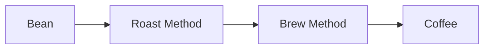

# Coffee

| Parameter               | **Lower Value Effect**                         | **Higher Value Effect**                             |
| ----------------------- | ---------------------------------------------- | --------------------------------------------------- |
| **Grind Size**          | Coarser grind → weaker, sour, under-extracted  | Finer grind → stronger, more bitter, over-extracted |
| **Brew Time**           | Shorter time → sour, thin, under-extracted     | Longer time → bitter, heavy body, over-extracted    |
| **Water Temp**          | Cooler (<90°C / 195°F) → sour, under-extracted | Hotter (>96°C / 205°F) → bitter, burnt taste        |
| **Coffee Dose**         | Less coffee → weaker, thinner body             | More coffee → stronger, heavier, bolder taste       |
| **Water Ratio**         | More water → diluted, weak                     | Less water → concentrated, intense                  |
| **Pressure (Espresso)** | Lower pressure → sour, weak shot               | Higher pressure → more body, bitterness             |
| **Roast Level**         | Light roast → acidic, fruity, floral           | Dark roast → bold, bitter, smoky                    |
| **Brew Method**         | Filter (pour-over) → clean, bright, lighter    | Immersion (French press) → fuller body, oils        |

## Parameters

- Bean Specs
  - Origin
  - Roast
- Grind size.
- Water Quality

## Brewing Methods

- Drip/Pourover Coffee
  - Drip Coffee Maker
  - Chemex
  - Pourover Dripper
  - Vietnamese Drip
- Immersion
  - [French Press](https://www.youtube.com/watch?v=st571DYYTR8)
  - [Clever Dripper](https://www.youtube.com/watch?v=RpOdennxP24)
  - Cold Brew
- Pressure Brewed Coffee
  - Moka Pot
- Espresso Maker

#### Cold Brew

- 1:10 coffee to water. Adjust this to preference.
- Leave course grind coffee in water for 24 hours+.

#### Moka Pot

- Beans - Medium to dark roast.
- Grind Size - Coarser than espresso.
- Heat
  - Start with hot water.
  - Low heat.
  - Kill heat before the coffee starts to come out sputtery.

  

#### Common Drinks

- Espresso
- Double Espresso (Doppio) - Espresso x2
- Americano - Espresso + hot water
- Milk based drinks
  - Latte - Espresso + lots of steamed milk + a little foam.
  - Cappuccino - Espresso + equal parts steamed milk and foam.
  - Flat white - Similar to a latte but smaller with thinner microfoam.
  - Macchiato - Espresso + a small dollop of milk or foam.
  - Cortado - Equal parts espresso and steamed milk.
  - Mocha - Latte + chocolate syrup + whip (optional).
- Drip Coffee

### Barista Notes

- Add sweetener before pulling expresso shot.
- Light amount of water to clean steam wand.

    

    

      
    

  

