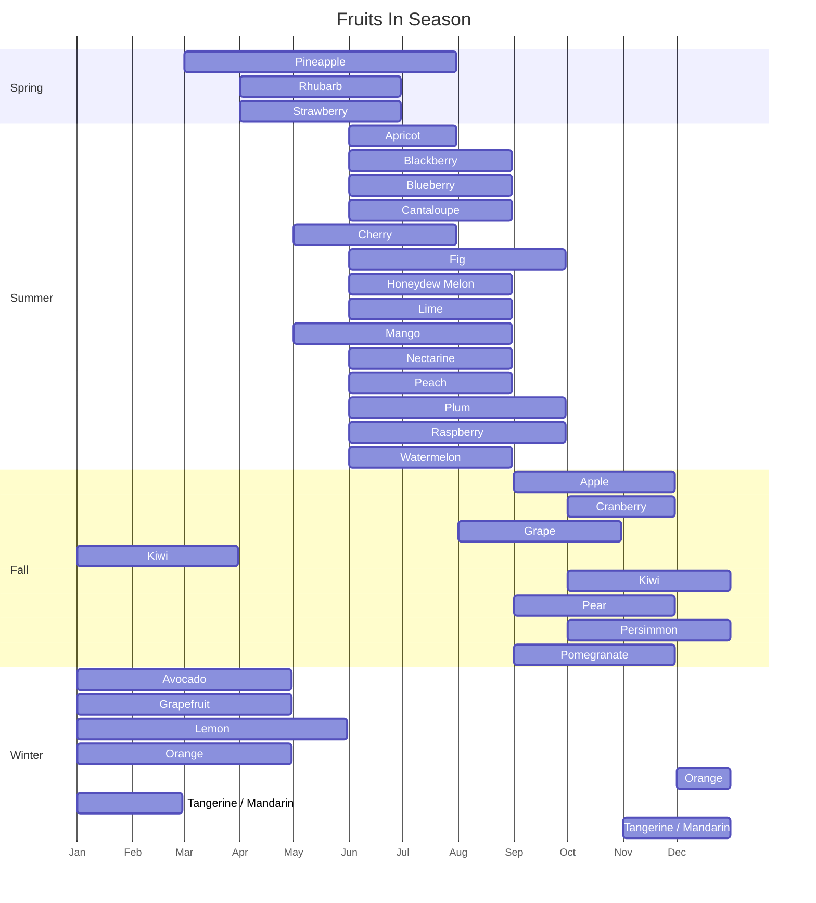

# Fruits

Peak season for a temperate Northern Hemisphere climate (e.g. the continental US); actual availability varies by region and is wider wherever imports or greenhouse growing are common.

## Table of Contents

- [Seasonality](#seasonality)
  - [In Season by Month](#in-season-by-month)
  - [Seasonal Timeline](#seasonal-timeline)
- [See Also](#see-also)

## Seasonality

### In Season by Month

| Fruit                | Season         | Peak Months |
| -------------------- | -------------- | ----------- |
| Apple                | Fall           | Sep–Nov     |
| Apricot              | Summer         | Jun–Jul     |
| Avocado              | Winter, Spring | Jan–Apr     |
| Blackberry           | Summer         | Jun–Aug     |
| Blueberry            | Summer         | Jun–Aug     |
| Cantaloupe           | Summer         | Jun–Aug     |
| Cherry               | Summer         | May–Jul     |
| Cranberry            | Fall           | Oct–Nov     |
| Fig                  | Summer, Fall   | Jun–Sep     |
| Grape                | Fall           | Aug–Oct     |
| Grapefruit           | Winter         | Jan–Apr     |
| Honeydew Melon       | Summer         | Jun–Aug     |
| Kiwi                 | Fall, Winter   | Oct–Mar     |
| Lemon                | Winter, Spring | Jan–May     |
| Lime                 | Summer         | Jun–Aug     |
| Mango                | Summer         | May–Aug     |
| Nectarine            | Summer         | Jun–Aug     |
| Orange               | Winter         | Dec–Apr     |
| Peach                | Summer         | Jun–Aug     |
| Pear                 | Fall           | Sep–Nov     |
| Persimmon            | Fall, Winter   | Oct–Dec     |
| Pineapple            | Spring, Summer | Mar–Jul     |
| Plum                 | Summer         | Jun–Sep     |
| Pomegranate          | Fall           | Sep–Nov     |
| Raspberry            | Summer         | Jun–Sep     |
| Rhubarb              | Spring         | Apr–Jun     |
| Strawberry           | Spring, Summer | Apr–Jun     |
| Tangerine / Mandarin | Winter         | Nov–Feb     |
| Watermelon           | Summer         | Jun–Aug     |

### Seasonal Timeline

Grouped by each fruit's first-listed season; a bar split in two means the peak window wraps across the new year (e.g. Orange peaks Dec–Apr, drawn as Jan–Apr plus Dec). Dates use an arbitrary year — only the month position matters.

