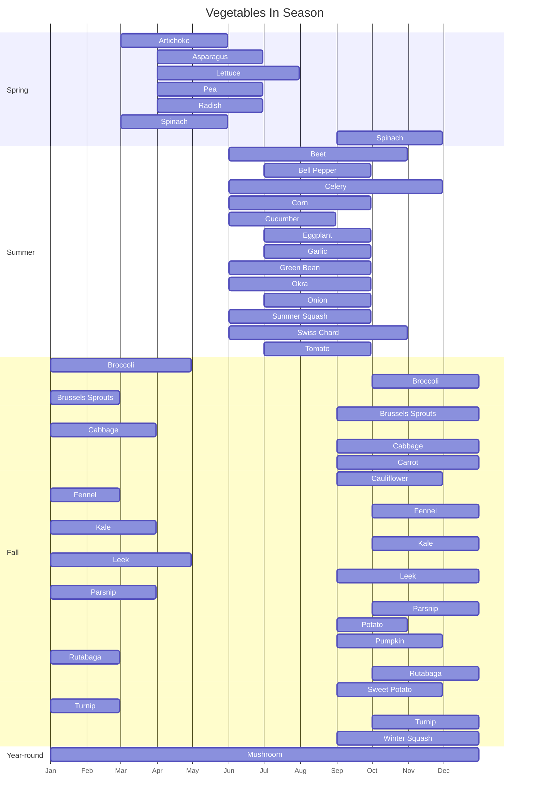

# Vegetables

Peak season for a temperate Northern Hemisphere climate (e.g. the continental US); actual availability varies by region and is wider wherever imports or greenhouse growing are common.

## Table of Contents

- [Seasonality](#seasonality)
  - [In Season by Month](#in-season-by-month)
  - [Seasonal Timeline](#seasonal-timeline)
- [📊 Density Order (densest → most tender)](#-density-order-densest--most-tender)
  - [🟤 Hard / Dense Vegetables](#-hard--dense-vegetables)
  - [🟠 Medium / Semi-Dense Vegetables](#-medium--semi-dense-vegetables)
  - [🟢 Light / Tender Vegetables](#-light--tender-vegetables)
- [🔑 Rules of Thumb](#-rules-of-thumb)
- [See Also](#see-also)

## Seasonality

### In Season by Month

| Vegetable                        | Season         | Peak Months      |
| -------------------------------- | -------------- | ---------------- |
| Artichoke                        | Spring         | Mar–May          |
| Asparagus                        | Spring         | Apr–Jun          |
| Beet                             | Summer, Fall   | Jun–Oct          |
| Bell Pepper                      | Summer         | Jul–Sep          |
| Broccoli                         | Fall, Spring   | Oct–Apr          |
| Brussels Sprouts                 | Fall, Winter   | Sep–Feb          |
| Cabbage                          | Fall, Winter   | Sep–Mar          |
| Carrot                           | Fall           | Sep–Dec          |
| Cauliflower                      | Fall           | Sep–Nov          |
| Celery                           | Summer, Fall   | Jun–Nov          |
| Corn (Sweet Corn)                | Summer         | Jun–Sep          |
| Cucumber                         | Summer         | Jun–Aug          |
| Eggplant                         | Summer         | Jul–Sep          |
| Fennel                           | Fall, Winter   | Oct–Feb          |
| Garlic                           | Summer         | Jul–Sep          |
| Green Bean                       | Summer         | Jun–Sep          |
| Kale                             | Fall, Winter   | Oct–Mar          |
| Leek                             | Fall, Winter   | Sep–Apr          |
| Lettuce                          | Spring, Summer | Apr–Jul          |
| Mushroom                         | Year-round     | —                |
| Okra                             | Summer         | Jun–Sep          |
| Onion                            | Summer         | Jul–Sep          |
| Parsnip                          | Fall, Winter   | Oct–Mar          |
| Pea (Sugar Snap / Snow)          | Spring         | Apr–Jun          |
| Potato                           | Fall           | Sep–Oct          |
| Pumpkin                          | Fall           | Sep–Nov          |
| Radish                           | Spring         | Apr–Jun          |
| Rutabaga                         | Fall, Winter   | Oct–Feb          |
| Spinach                          | Spring, Fall   | Mar–May, Sep–Nov |
| Summer Squash (Zucchini)         | Summer         | Jun–Sep          |
| Sweet Potato                     | Fall           | Sep–Nov          |
| Swiss Chard                      | Summer, Fall   | Jun–Oct          |
| Tomato                           | Summer         | Jul–Sep          |
| Turnip                           | Fall, Winter   | Oct–Feb          |
| Winter Squash (Butternut, Acorn) | Fall           | Sep–Dec          |

### Seasonal Timeline

Grouped by each vegetable's first-listed season; a bar split in two means the peak window wraps across the new year (e.g. Kale peaks Oct–Mar, drawn as Jan–Mar plus Oct–Dec). Dates use an arbitrary year — only the month position matters.

## 📊 Density Order (densest → most tender)

_Add to the pan top-to-bottom. Times are for medium-heat stir-fry with a typical cut._

| #   | Vegetable                          | Band   | Stir-fry              | Boil       |
| --- | ---------------------------------- | ------ | --------------------- | ---------- |
| 1   | Potato / sweet potato              | Hard   | 8–10 min (thin slice) | 15–25 min  |
| 2   | Beet / turnip / rutabaga           | Hard   | par-cook first        | 20–30 min  |
| 3   | Carrot                             | Hard   | 6–8 min               | 10–15 min  |
| 4   | Winter squash (butternut, kabocha) | Hard   | 6–8 min               | 10–15 min  |
| 5   | Cauliflower / broccoli stem        | Medium | 5–7 min               | 5–8 min    |
| 6   | Green bean                         | Medium | 4–6 min               | 4–6 min    |
| 7   | Onion / fennel                     | Medium | 4–6 min               | 5–8 min    |
| 8   | Bell pepper                        | Medium | 3–5 min               | 3–5 min    |
| 9   | Eggplant                           | Medium | 3–5 min               | 4–6 min    |
| 10  | Zucchini                           | Medium | 3–4 min               | 3–4 min    |
| 11  | Chinese cabbage stems (napa)       | Medium | 2–3 min               | 3–4 min    |
| 12  | Broccoli florets / asparagus       | Light  | 2–3 min               | 2–3 min    |
| 13  | Mushroom                           | Light  | 2–3 min               | n/a        |
| 14  | Snow peas / sugar snap peas        | Light  | 1–2 min               | 1–2 min    |
| 15  | Bok choy                           | Light  | 1–2 min               | 1–2 min    |
| 16  | Chinese cabbage leaves (napa)      | Light  | 1 min                 | 1 min      |
| 17  | Tomato                             | Light  | 1–2 min               | n/a        |
| 18  | Spinach / kale / chard             | Light  | 30 s–1 min            | 30 s–1 min |
| 19  | Fresh herbs                        | Light  | off heat              | n/a        |

### 🟤 Hard / Dense Vegetables

_Takes longest to cook — good for roasting, boiling, or stews.
For stir-fry, slice very thin or par-cook first._

- Potatoes
- Sweet potatoes
- Carrots
- Beets
- Parsnips
- Turnips
- Rutabaga (Swede)
- Butternut squash, acorn squash, kabocha
- Jerusalem artichokes (sunchokes)
- Celeriac (celery root)

### 🟠 Medium / Semi-Dense Vegetables

_Cook moderately fast — balance between structure and tenderness._

- Broccoli stems
- Cauliflower
- Brussels sprouts
- Green beans
- Zucchini / courgette
- Eggplant / aubergine
- Bell peppers
- Asparagus (bottom stems)
- Cabbage (thicker wedges)
- Chinese cabbage / napa (stems)
- Fennel
- Onions

### 🟢 Light / Tender Vegetables

_Cook quickly — great for stir-fries, quick blanch, or steaming.
Often added at the end of dishes._

- Broccoli florets
- Spinach
- Kale / chard
- Bok choy / pak choi
- Chinese cabbage / napa (leaves)
- Lettuce (for hot dishes, very quick)
- Snow peas / sugar snap peas
- Mushrooms
- Tomato
- Asparagus tips
- Leeks
- Fresh herbs (basil, parsley, dill, cilantro, etc.)

## 🔑 Rules of Thumb

- Cook vegetables on high heat.
- **Dense roots & tubers** → Start first
  - Boil 10–30 min
  - Roast 25–45 min
  - Stir-fry only if cut very thin
- **Medium veg** → Moderate cooking time
  - Boil 5–10 min
  - Roast 15–25 min
  - Stir-fry 5–7 min
- **Tender greens** → Last in the pan
  - Boil/blanch 1–3 min
  - Stir-fry 1–2 min
  - Often just wilted at the end

## See Also

- [Potatoes](./potatoes.md)
