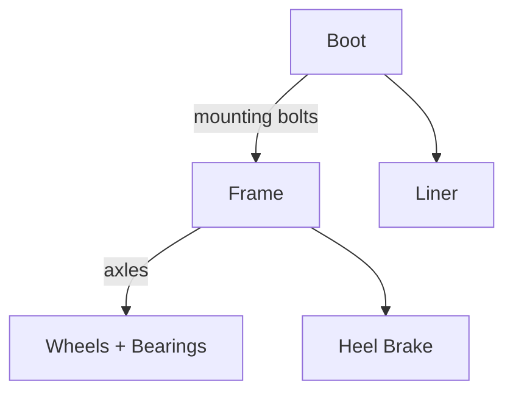

# Inline Skate

## Table of Contents

- [Anatomy](#anatomy)
  - [Assembly](#assembly)
  - [Parts](#parts)
  - [Mounting](#mounting)
  - [Boot](#boot)
  - [Frames](#frames)
    - [Frame Types](#frame-types)
    - [Frame Length](#frame-length)
  - [Wheels](#wheels)
- [Packlist](#packlist)

## Anatomy

### Assembly

### Parts

| Part     | Description                                                                                | Image                                                                                                                                                                                                                                        |
| -------- | ------------------------------------------------------------------------------------------ | -------------------------------------------------------------------------------------------------------------------------------------------------------------------------------------------------------------------------------------------- |
| Axles    | Bolts through the wheels that clamp them into the frame; removed to rotate or swap wheels. |                                                                                           |
| Bearings | Two 608 bearings per wheel with a spacer between them.                                     |                                                                                                                                                                                                                                              |
| Boot     | Soft, hard-shell, or hybrid carbon shell; carries the liner and closures.                  |                                                                                                                                                                                                                                              |
| Frame    | Aluminium, carbon, or plastic rail bolted under the boot that holds the wheels.            |  |
| Liner    | Padded inner boot; removable on most hard-shell and hybrid skates.                         |                                                                                                                                                                                                                                              |
| Wheels   | Urethane, sized in mm and rated in durometer; 3 or 4 per frame.                            |                                                                                                                                                                                                                                              |

### Mounting

The connection on the boot that the frame bolts to — it decides which frames fit the boot.

| Mount             | Description                                                                                                                         | Image                                                                                                                                                                                                                                                     |
| ----------------- | ----------------------------------------------------------------------------------------------------------------------------------- | --------------------------------------------------------------------------------------------------------------------------------------------------------------------------------------------------------------------------------------------------------- |
| 2 Point (165mm)   | Two bolts 165mm apart, the recreational standard; came from speed skating and includes ~10mm heel lift.                             |                                                                                                                                                                                                                                                           |
| 2 Point (195mm)   | Two bolts 195mm apart, introduced 2003; fits larger wheels without raising the frame. Mostly speed.                                 |                                                                                                                                                                                                                                                           |
| Trinity (3 Point) | Powerslide's 2016 standard — two front mounts on the sides plus one at the heel, for a lower stance and more direct power transfer. |  |
| UFS               | Universal Frame System — flat mount with no heel lift, used on aggressive skates so the soulplate sits low for grinds.              |       |

### Boot

| Boot   | Construction                                                                                        | Feel                                                                                                 | Image                                                                                                                                                                                                                                   |
| ------ | --------------------------------------------------------------------------------------------------- | ---------------------------------------------------------------------------------------------------- | --------------------------------------------------------------------------------------------------------------------------------------------------------------------------------------------------------------------------------------- |
| Hard   | Rigid plastic or carbon shell with a removable padded liner inside.                                 | Stiff and precise, holds the ankle firmly, needs no break-in but is warm and unforgiving on fit.     |              |
| Hybrid | Soft padded boot built around a carbon or plastic shell, so the shell is inside instead of outside. | Support close to a hard boot with the comfort and weight of a soft one; the usual urban choice.      |  |
| Soft   | Padded fabric boot with a plastic cuff or exoskeleton for support.                                  | Comfortable, light, and breathable straight away, but flexes under hard pushes and wears out sooner. |                                                                          |

The liner inside a hard or hybrid shell does the fitting, and can be swapped or heat-moulded on its own.

### Frames

#### Frame Types

| Frame Type | Description                                                                                  | Image                                                                                                                                                                                                                                                                                                          |
| ---------- | -------------------------------------------------------------------------------------------- | -------------------------------------------------------------------------------------------------------------------------------------------------------------------------------------------------------------------------------------------------------------------------------------------------------------- |
| Big Wheel  | Built around 100mm+ wheels for speed and distance; usually 3 wheels to keep the frame short. |  |
| Endless    | Versatile urban/distance frames that take several wheel configurations on one frame.         |                                                                                                                                                                                                                                                                                                                |
| UFS        | Aggressive frames with a grind gap, bolted to a UFS soulplate.                               |                                                                                               |
| Wizard     | Long, heavily rockered frames for freestyle and urban skating.                               |                                                                                                                                                                                                                                                                                                                |

#### Frame Length

The number printed on a frame — 263, 283, 12.8" — is its **length, measured axle centre to axle centre** (the wheelbase), not the overall length of the metal. A 283mm frame therefore sits on a wheelbase 20mm longer than a 263mm one.

| Longer frame (e.g. 283mm)                     | Shorter frame (e.g. 263mm)                         |
| --------------------------------------------- | -------------------------------------------------- |
| More stable at speed, holds a glide           | Turns tighter, easier in crowds and on transitions |
| Longer push, better for distance and marathon | Faster footwork for slalom, hockey, freestyle      |
| Room for bigger wheels (110mm, 125mm)         | Keeps small wheels close together                  |

Typical ranges (manufacturers vary):

| Length         | Typical setup          | Used for                  |
| -------------- | ---------------------- | ------------------------- |
| ~231–245mm     | 4x76–4x80              | Slalom, freestyle, kids   |
| ~245–265mm     | 4x84–4x90, 3x100–3x110 | Urban, all-round          |
| ~265–290mm     | 3x110, 3x125, 4x100    | Fitness, distance         |
| 12.8" (~325mm) | 4x100–4x110, 3x125     | Speed and marathon racing |

Frame length should track boot size; a long frame on a small boot overhangs and steers badly.

### Wheels

| Setup       | Description                                                                                                              | Image                                                                                                                                                                                                                                                                                                       |
| ----------- | ------------------------------------------------------------------------------------------------------------------------ | ----------------------------------------------------------------------------------------------------------------------------------------------------------------------------------------------------------------------------------------------------------------------------------------------------------- |
| Anti-Rocker | Large outer wheels with small hard or plastic inner wheels, leaving a grind gap for aggressive skating.                  |                                                                                                                                                                                                                                                                                                             |
| Flat        | All wheels the same size, all touching the ground — most speed, stability, and roll.                                     |  |
| Hi-Lo       | Wheels or axle heights stepped so the heel sits higher than the toe, pitching the shin forward. Common on hockey skates. |                   |
| Rocker      | Middle wheels sit lower (or outer wheels raised ~2mm), curving the wheelbase for quick turns — freestyle and urban.      |                                                                                                                                                                                                                                                                                                             |

## Packlist

- Skates
- Skate Tool
- **Optional**
  - Shoes
  - Speaker
