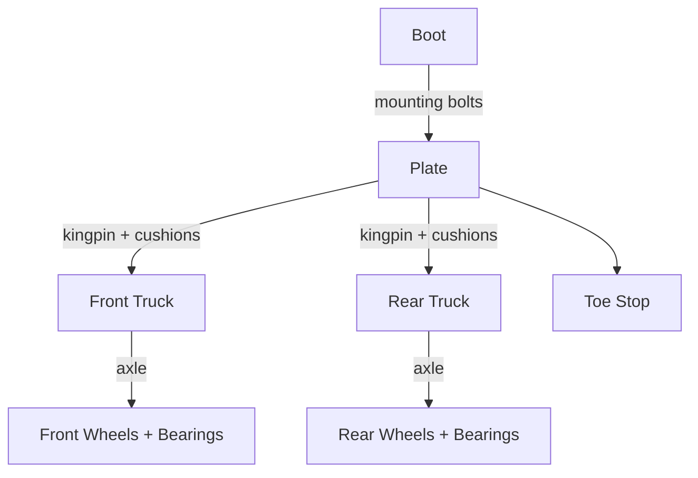

# Roller Skate

## Table of Contents

- [Anatomy](#anatomy)
  - [Assembly](#assembly)
  - [Parts](#parts)
  - [Mounting](#mounting)
  - [Boot](#boot)
  - [Plate](#plate)
  - [Toe Stops](#toe-stops)
  - [Wheels](#wheels)
    - [Wheel Parts](#wheel-parts)
    - [Wheel Types](#wheel-types)
    - [Hubs](#hubs)

## Anatomy

### Assembly

### Parts

| Part     | Description                                                                 | Image                                                                                                                                                                                                                                                                                                   |
| -------- | --------------------------------------------------------------------------- | ------------------------------------------------------------------------------------------------------------------------------------------------------------------------------------------------------------------------------------------------------------------------------------------------------- |
| Bearings | Two 608 bearings per wheel with a spacer between them.                      |                                                                                                                                             |
| Boot     | Leather or synthetic boot, high-top or low-cut, laced over a padded tongue. |                                                                                                                                              |
| Plate    | Nylon or aluminium chassis bolted under the boot, carrying both trucks.     |  |
| Toe Stop | Rubber stop threaded into the front of the plate, adjustable for height.    |                                                                                                                                                                                                                                                                                                         |
| Trucks   | Two per skate; they hold the axles and steer as the skater leans.           |                                                                                                                                                                          |
| Wheels   | Four urethane wheels, sized in mm and rated in durometer.                   |                     |

### Mounting

The plate bolts through the boot's outsole — a pair of bolts under the ball of the foot, a pair in the heel — onto T-nuts or washers inside. Where those holes sit sets the wheelbase and where the front axle falls relative to the ball of the foot.

| Mount         | Plate position                                                             | Feel                                                         |
| ------------- | -------------------------------------------------------------------------- | ------------------------------------------------------------ |
| Long          | Plate a size up, wheelbase extended past the standard position.            | Most stable at speed, slowest to turn.                       |
| Short (Dance) | Plate roughly one size smaller than the boot, shortening the wheelbase.    | Tighter turning circle and quick footwork for dance and jam. |
| Short Forward | Short plate pushed forward so the front axle sits at or ahead of the ball. | Most agile; the derby and speed setup.                       |
| Standard      | Front axle directly under the ball of the foot or slightly ahead of it.    | Stable and predictable; the default recreational mount.      |

Plates are sold by wheelbase, matched to boot size; too long drags the turn, too short gets twitchy.

### Boot

| Part          | Description                                                                       | Image                                                                                                                                                       |
| ------------- | --------------------------------------------------------------------------------- | ----------------------------------------------------------------------------------------------------------------------------------------------------------- |
| Ankle Padding | Foam collar around the ankle that limits side-to-side slop and prevents rubbing.  |                                                                                                                                                             |
| Eyelets       | Reinforced lace holes; upper ones are often hooks for faster tightening.          |                                                                                                                                                             |
| Footbed       | Removable insole under the foot, frequently swapped for arch support.             |                                                                                                                                                             |
| Heel          | Raised block under the rear of the boot that shifts weight forward over the toes. |                                                                                                                                                             |
| Laces         | Primary closure; lacing tension controls how much the ankle can flex.             |                                                                                                                                                             |
| Outsole       | Bottom surface of the boot that the plate mounts to.                              |                                                                                                                                                             |
| Power Strap   | Velcro or buckle strap over the instep that locks the heel into the boot.         |                                                                                                                                                             |
| Toe Box       | Front of the boot enclosing the toes; hard on rhythm boots, soft on derby boots.  |                                                                                                                                                             |
| Tongue        | Padded flap under the laces that spreads pressure across the instep.              |                                                                                                                                                             |
| Upper         | Leather, suede, or synthetic body of the boot; high-top adds ankle support.       |  |

### Plate

| Part           | Description                                                                          | Image                                                                                                                                                                                                                                                                                                   |
| -------------- | ------------------------------------------------------------------------------------ | ------------------------------------------------------------------------------------------------------------------------------------------------------------------------------------------------------------------------------------------------------------------------------------------------------- |
| Action Nut     | Nut on the kingpin that sets cushion compression, tuning how easily the skate turns. |                                                                                                                                                                                                                                                                                                         |
| Cushions       | Urethane bushings around the kingpin that let the truck lean and spring back.        |                                                                                                                                                                                                                                                                                                         |
| Jump Bar       | Reinforcing bar between the front and rear trucks on some plates.                    |                                                                                                                                                                                                                                                                                                         |
| Kingpin        | Bolt holding the truck to the plate and running through the cushions.                |                                                                                                                                                                                                                                                                                                         |
| Mounting Bolts | Hardware fixing the plate to the boot's outsole.                                     |                                                                                                                                                                                                                                                                                                         |
| Pivot Cup      | Urethane cup seating the pivot pin and setting the truck's pivot point.              |                                                                                                                                                                                                                                                                                                         |
| Pivot Pin      | Stud on the truck that sits in the pivot cup, the truck's turning axis.              |                                                                                                                                                                                                                                                                                                         |
| Plate          | Nylon or aluminium chassis bolted under the boot that carries both trucks.           |  |
| Toe Stop       | Threaded rubber stop at the front used for stopping, starts, and toe tricks.         |                                                                                                                                                                                                                                                                                                         |
| Toe Stop Nut   | Lock nut clamping the toe stop stem at the chosen height.                            |                                                                                                                                                                                                                                                                                                         |
| Trucks         | Axle-carrying assemblies mounted to the plate that steer as the skater leans.        |                                                                                                                                                                          |

### Toe Stops

The plate's front hole takes either a stop or a plug.

| Fitting            | What it is                                                                                | Used for                                                                |
| ------------------ | ----------------------------------------------------------------------------------------- | ----------------------------------------------------------------------- |
| Jam Plug           | Low-profile plastic or rubber plug filling the toe stop hole, sitting nearly flush.       | Dance and jam skating, where a stop catches; also protects rink floors. |
| Toe Plug           | Another name for a jam plug; some shops reserve it for the fully flush, non-grip version. | Same as a jam plug.                                                     |
| Toe Stop           | Rubber stop on a threaded 5/8" stem, height set by a lock nut against the plate.          | Braking, toe starts, and toe tricks; adjustable as the stop wears down. |
| Toe Stop (Bolt-On) | Fixed stop held by a 5/16" screw through the plate, with no height adjustment.            | Simple recreational setups and plates without a threaded housing.       |

Never leave the hole empty — the exposed housing drags and damages rink floors. Grippier rubber brakes harder and wears faster; harder compounds slide and last longer.

### Wheels

#### Wheel Parts

| Part       | Description                                                                             | Image                                                                                                                                                                                                                                                                                                                                                         |
| ---------- | --------------------------------------------------------------------------------------- | ------------------------------------------------------------------------------------------------------------------------------------------------------------------------------------------------------------------------------------------------------------------------------------------------------------------------------------------------------------- |
| Axle       | Threaded rod on the truck that the wheel and bearings ride on.                          |                                                                                                                                                                                                                                                                                                                                                               |
| Axle Nut   | Nylock nut holding the wheel on the axle; overtightening binds the bearings.            |                                                                                                                                                                                                                                                                                                                                                               |
| Bearings   | Two per wheel, usually 608 size, rated on the ABEC scale for precision.                 |                                                                                                                                                                                                   |
| Durometer  | Wheel hardness on the "A" scale — low 70sA grips outdoors, 90sA+ slides on rink floors. |                                                                                                                                                                                                                                                                                                                                                               |
| Hub        | Plastic or aluminium core the urethane is cast around, holding the bearings.            |  |
| Spacer     | Tube between the two bearings that keeps them square under the axle nut.                |                                                                                                      |
| Speed Ring | Thin washer between bearing and axle nut or truck face to cut friction.                 |                                                                                                                                                                                                                                                                                                                                                               |
| Wheel      | Urethane roller, typically 56-65mm on quads; narrower for derby, wider for outdoor.     |                                                                           |

#### Wheel Types

| Type          | Typical size and hardness | Suited to                                                                     |
| ------------- | ------------------------- | ----------------------------------------------------------------------------- |
| Artistic      | 57–62mm, 95A+ or clay     | Rink dance and figures; clay composition wheels still used for grip and feel. |
| Derby         | 59–62mm, 88A–95A          | Sport court and polished concrete; narrow and grippy for hard cornering.      |
| Hybrid        | 62mm, 85A–88A             | Skaters moving between rink and street on one set of wheels.                  |
| Indoor (Rink) | 57–62mm, 95A–103A         | Slick maple or coated rink floors; hard and slippy for fast crossovers.       |
| Outdoor       | 62–70mm, 78A–85A          | Asphalt and pavement; soft and large to soak up cracks and grit.              |

#### Hubs

The core the urethane is cast around. A stiffer hub puts more of the push into the ground; a softer one dampens vibration and costs less.

| Hub                     | Behaviour                                                                                         |
| ----------------------- | ------------------------------------------------------------------------------------------------- |
| Aluminium               | Stiffest and fastest, no flex under load; heaviest and most expensive.                            |
| Fibreglass-Filled Nylon | Glass-reinforced nylon — much stiffer than plain nylon, still light; the common mid-range choice. |
| Hubless                 | Solid urethane with no core; cheap, flexes badly, found on entry-level skates.                    |
| Nylon / Plastic         | Flexes under hard pushes, which dulls the roll but softens rough ground; inexpensive.             |
