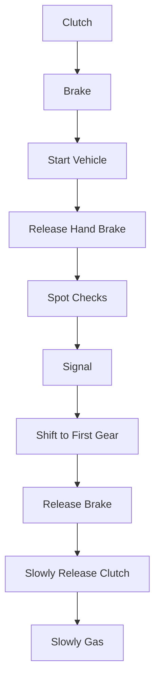
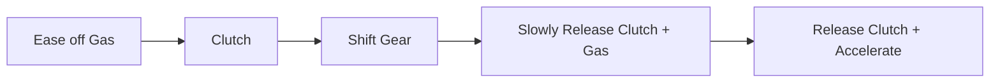

# Driving

- [Dutch Reach](https://www.rospa.com/policy/road-safety/advice/cyclists-and-motorcyclists/dutch-reach)

## Driving Manual

### Pedals

### Starting and Going

### Changing Gear

- For shifting down match your speed to the lower gear - you might need a bit more gas as you release the clutch to keep things smooth.

### Stopping and Parking

- Press the clutch down before you come to a complete stop (or the engine will stall), then shift to neutral.
- Parking - Park in gear with emergency brake on.
