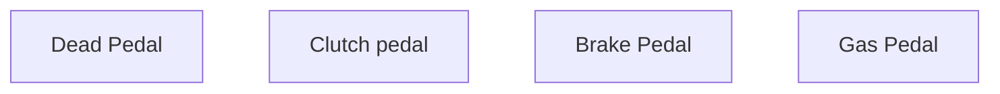
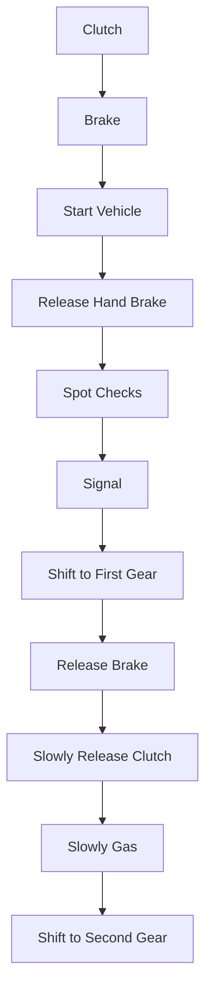
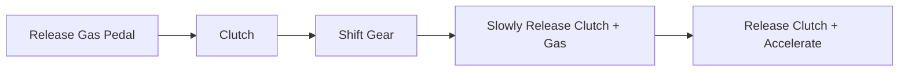
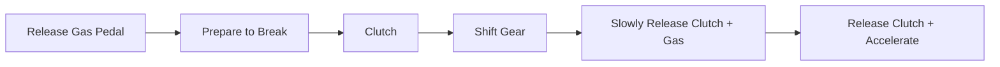
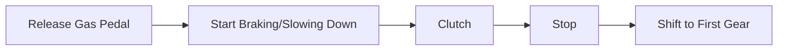

# Driving

- [Dutch Reach](https://www.rospa.com/policy/road-safety/advice/cyclists-and-motorcyclists/dutch-reach)

## Driving Manual

### Pedals

```mermaid
flowchart
DEAD_PEDAL[Dead Pedal]
CLUTCH_PEDAL[Clutch pedal]
BRAKE_PEDAL[Brake Pedal]
GAS_PEDAL[Gas Pedal]
```

### Starting and Going

```mermaid
flowchart TD

CLUTCH[Clutch]-->BRAKE[Brake]-->START_VEHICLE[Start Vehicle]-->HAND_BRAKE[Release Hand Brake]-->SPOT_CHECK[Spot Checks]-->SIGNAL[Signal]-->SHIFT_TO_FIRST_GEAR[Shift to First Gear]-->RELEASE_BRAKE[Release Brake]-->RELEASE_CLUTCH[Slowly Release Clutch]-->GAS[Slowly Gas]-->SHIFT_TO_SECOND_GEAR[Shift to Second Gear]
```

### Changing Gear

#### Shifting Gear Up

```mermaid
flowchart LR
RELEASE_GAS[Release Gas Pedal]-->CLUTCH[Clutch]-->SHIFT_GEAR[Shift Gear]-->RELEASE[Slowly Release Clutch + Gas]-->RELEASE_AND_ACCELERATE[Release Clutch + Accelerate]
```

#### Shifting Gear Down

```mermaid
flowchart LR
RELEASE_GAS[Release Gas Pedal]-->PREPARE_BRAKE[Prepare to Break]-->CLUTCH[Clutch]-->SHIFT_GEAR[Shift Gear]-->RELEASE[Slowly Release Clutch + Gas]-->RELEASE_AND_ACCELERATE[Release Clutch + Accelerate]
```

### Stopping and Parking

```mermaid
flowchart LR
RELEASE_GAS[Release Gas Pedal]-->START_BRAKING[Start Braking/Slowing Down]-->CLUTCH[Clutch]-->STOP[Stop]-->SHIFT_TO_FIRST_GEAR[Shift to First Gear]
```

- Press the clutch down before you come to a complete stop (or the engine will stall), then shift to neutral.
- Parking - Park in gear with emergency brake on.
