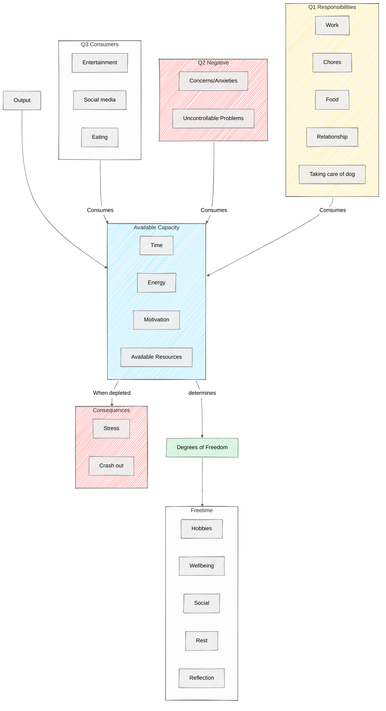

# Productivity

## Eisenhower Decision Matrix

- Q1 - Important and urgent.
- Q2 - Important and not urgent.
- Q3 - Not important and urgent.
- Q4 - Not important and not urgent.

### Q2 Deep Dive

- What we can't afford not to do Q2 tasks!
- Q2 negative vs Q2 positive
- Rest and recovery exists in Q2
  - Q4 activities that are actually Q2 activities
  - Ideally avoid Q4 activities or turn Q4 activities into Q2 activities. 
- Learning also lives in Q2

