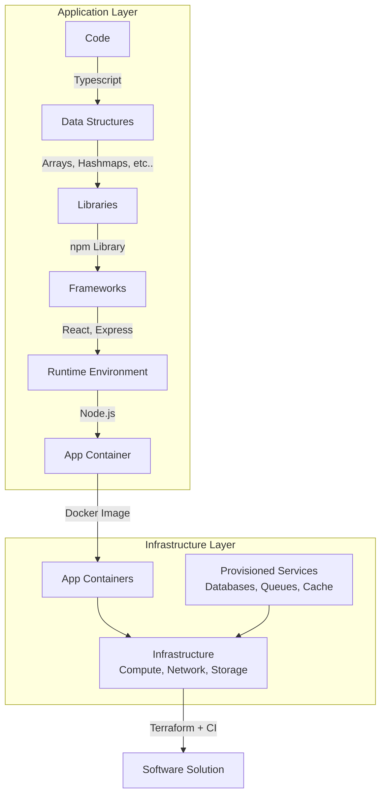
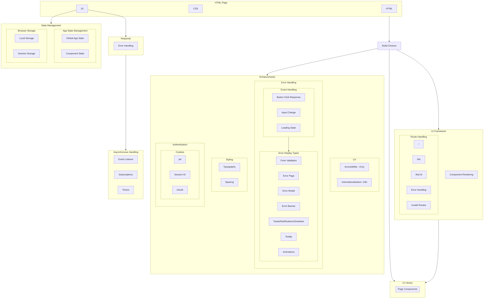
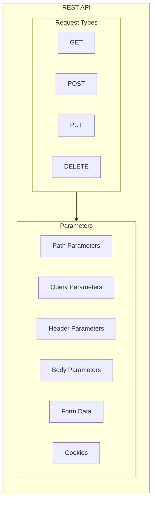

# Software Breakdown

CI Options
Jobs
Serverless functions
Serverless containers
VMs
K8s Cluster

Implementation
Scaling
Security
Alternatives

# Good Design

- Dynamic
- Agnostic
- Stateless
- Avoiding silent fail
- Performance and optimization.

# Refactor

- Resources
  - Secret Manager
  - Bootstrapping
- Environments
- CICD Pipeline
- Network Security
- Project Management
- Architecture
- **Web Development**
  - Database
    - Schema
    - SQL
      - One to Many
      - Many to Many
    - NoSQL
    - Backing up
  - Devops
    - Deployment
      - Manual Deployment
      - Automated Deployment
    - IaC
    - CICD
    - Automation Scripting
    - Containerization
    - Cloud
    - Networking
  - Version Control
    - Branching
    - Code Review Process
  - User Authentication System
  - Content Management System (CMS)
    - Headless vs Traditional CMS
  - Analytics
    - User Behavior Tracking
  - Security
    - Authentication Handling
    - Data Encryption
  - Code Maintenance
    - Type Annotation
    - Testing
      - Unit Testing
      - End to End (E2E)
      - Integration Testing
      - Performance Testing
      - Security Testing
  - Content Management
    - SEO
- **Application Monitoring**
  - Distributed Tracing: Understanding the flow of requests across microservices.
  - Performance Monitoring: Monitoring application performance through metrics.
  - Logging: Contextualizing trace and metric data with relevant logs.
- **Error Handling**
- **Software**
  - Stateless
  - New products
    - R&D Phase
      - APIs
      - Language
    - Solution choices
      - Long term support?
      - Maintainability
      - Accessibility
      - Pricing
      - Weight pros and cons
    - Development
      - Always start off overkill with base tooling
      - App building SQLite database
      - CI
    - Final Product
      - Documentation to reproduce
  - IaC
  - Personal dashboards
  - Monorepo
  - Library/OSS support
  - Setup scripts
  - Intellectual Property
  - What is strong documentation?
    - You are easily able to redeploy assets again.
    - Common commands
    - Setup commands
    - References
    - Useful links: Management settings, API docs, billing, etc
  - Caveats
    - Scaling
      - Large automations susceptible to injection
      - As interfaces grow there are more attack surfaces
    - Security
      - Can add friction to development.

## Frontend Design

## Backend

