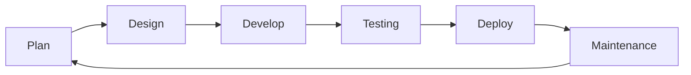

# Software Lifecycle

## Table of Contents

- [Phases](#phases)
- [Cycle](#cycle)

## Phases

| Phase       | Description                                                            |
| ----------- | ---------------------------------------------------------------------- |
| Plan        | Gather and document what the software needs to do.                     |
| Design      | Plan architecture, data models, and interfaces before writing code.    |
| Develop     | Write the code that satisfies the design.                              |
| Testing     | Verify behavior against requirements and catch regressions.            |
| Deploy      | Release the software to its target environment.                        |
| Maintenance | Fix bugs, patch dependencies, and adapt to new requirements over time. |

## Cycle

