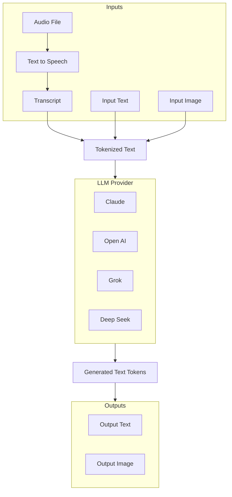

# LLM

```mermaid
flowchart

subgraph INPUTS[Inputs]
    AUDIO_FILE[Audio File]
    TEXT_TO_SPEECH[Text to Speech]
    TRANSCRIPT[Transcript]
    INPUT_TEXT[Input Text]
    INPUT_IMAGE[Input Image]
end

TOKENIZED_INPUT_TEXT[Tokenized Text]

subgraph LLM_PROVIDER[LLM Provider]
    CLAUDE[Claude]
    OPEN_AI[Open AI]
    GROK[Grok]
    DEEP_SEEK[Deep Seek]
end

GENERATED_TEXT_TOKENS[Generated Text Tokens]

subgraph OUTPUTS[Outputs]
    OUTPUT_TEXT[Output Text]
    OUTPUT_IMAGE[Output Image]
end

AUDIO_FILE-->TEXT_TO_SPEECH-->TRANSCRIPT

TRANSCRIPT-->TOKENIZED_INPUT_TEXT
INPUT_TEXT-->TOKENIZED_INPUT_TEXT
INPUT_IMAGE-->TOKENIZED_INPUT_TEXT

TOKENIZED_INPUT_TEXT-->LLM_PROVIDER
LLM_PROVIDER-->GENERATED_TEXT_TOKENS-->OUTPUTS
```

## Human Readable Senses

- Hearing and seeing.
- Unable to smell, taste, feel.
