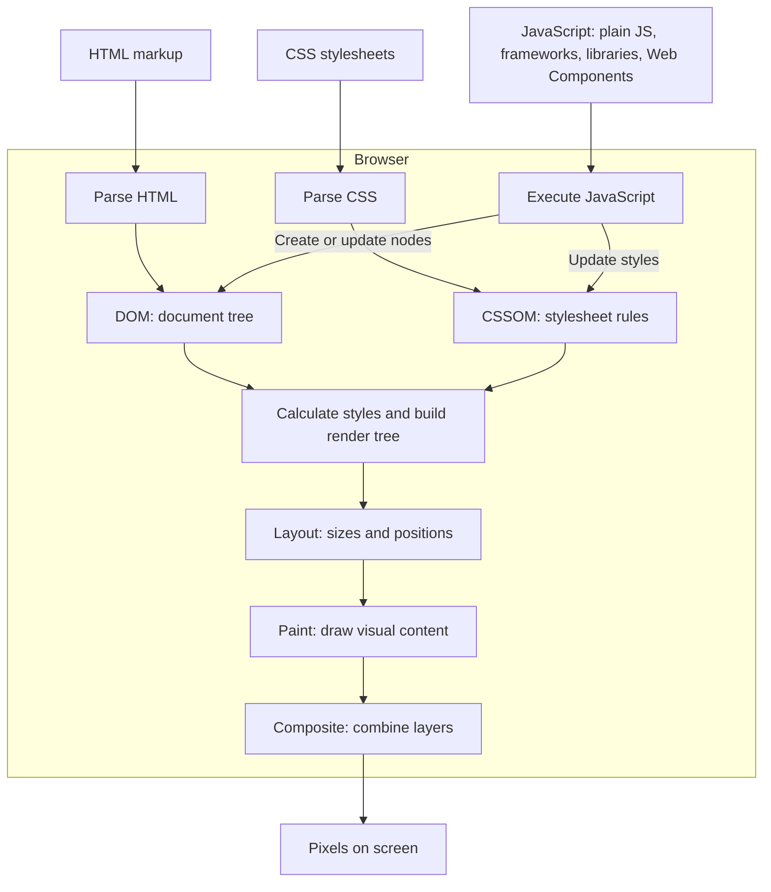

# Frontend Developer

## Table of Contents

- [Browser Rendering](#browser-rendering)
  - [Browser UI Approaches](#browser-ui-approaches)
- [Styling and UI Components](#styling-and-ui-components)
  - [Styling Languages and Utilities](#styling-languages-and-utilities)
  - [UI Component Tools](#ui-component-tools)
- [Tools](#tools)
  - [State Management](#state-management)
  - [Templating](#templating)
  - [Frameworks and Libraries](#frameworks-and-libraries)
- [Mobile Development](#mobile-development)

## Browser Rendering

This is a simplified rendering flow. Native elements and custom elements are DOM nodes; optional Shadow DOM holds a custom element's internal nodes. Frameworks and libraries ultimately use browser APIs to update nodes or styles. Changes can trigger the affected rendering stages again; not every update requires layout or paint.

### Browser UI Approaches

These browser-level approaches can be combined with frameworks and libraries: a React app can render a Lit component containing native buttons. For comparisons of React, Vue, Svelte, Lit, and htmx, see [Web Frameworks and Libraries](../frameworks-and-libraries.md).

| Approach               | What It Is                                                           | Pros                                                                          | Cons                                                                                                                            | Best Used For                                                     |
| ---------------------- | -------------------------------------------------------------------- | ----------------------------------------------------------------------------- | ------------------------------------------------------------------------------------------------------------------------------- | ----------------------------------------------------------------- |
| Built-in HTML elements | Browser-provided tags such as `<button>`, `<input>`, and `<dialog>`. | No framework dependency; built-in semantics and behavior.                     | Limited to the controls the browser provides; application behavior still needs code.                                            | Foundation for almost every website.                              |
| Native Web Components  | Custom browser elements, optionally using Shadow DOM.                | Reusable across frameworks; optional isolation of internal markup and styles. | Manual rendering and state updates without a helper library; styling, forms, accessibility, and server rendering need planning. | Embeddable widgets and components shared across different stacks. |
| Plain JavaScript + DOM | Directly create elements, attach listeners, and update the DOM.      | Full control; little setup; no framework required.                            | You manage state, updates, and listener cleanup yourself; complexity grows with the UI.                                         | Small widgets and simple interactions.                            |

Native Web Components use built-in browser APIs rather than an installed library or framework.

## Styling and UI Components

### Styling Languages and Utilities

| Technology      | Description                                                                                                              | Pros                                                                    | Cons                                                                                                        | Best Used For                                                                            |
| --------------- | ------------------------------------------------------------------------------------------------------------------------ | ----------------------------------------------------------------------- | ----------------------------------------------------------------------------------------------------------- | ---------------------------------------------------------------------------------------- |
| [CSS](./css.md) | Browser-native styling language for layout, colors, fonts, and responsive presentation.                                  | Full styling control; no compilation required; works with any UI stack. | You organize styles and reusable patterns yourself; cascade and specificity can become difficult to manage. | Styling any website, especially when direct control and minimal tooling matter.          |
| SCSS            | A Sass syntax extending CSS with variables, nesting, mixins, functions, and other authoring features; compiled into CSS. | Reuses style logic and organizes complex stylesheets.                   | Requires compilation; excessive nesting and abstractions can complicate generated CSS.                      | Stylesheets that benefit from shared mixins, functions, and build-time style generation. |
| Tailwind CSS    | CSS framework using utility classes such as `p-4` to compose styles in markup.                                           | Fast composition; shared design tokens; responsive and state variants.  | Class-heavy markup; requires CSS generation tooling; provides no interactive component behavior by itself.  | Custom interfaces and component systems that benefit from styling directly in markup.    |

### UI Component Tools

| Technology                  | Description                                                                                                                 | Pros                                                                              | Cons                                                                                               | Best Used For                                                                               |
| --------------------------- | --------------------------------------------------------------------------------------------------------------------------- | --------------------------------------------------------------------------------- | -------------------------------------------------------------------------------------------------- | ------------------------------------------------------------------------------------------- |
| [Bootstrap](./bootstrap.md) | CSS framework with styled components, a responsive grid, and JavaScript plugins for interactions.                           | Ready-made controls and consistent defaults speed up development.                 | Distinctive designs require customization; unused styles and scripts can add weight.               | Prototypes, internal tools, and sites that fit conventional component layouts.              |
| Radix UI                    | Unstyled React primitives providing interaction behavior and accessibility features for controls such as dialogs and menus. | Handles many keyboard, focus, and ARIA patterns; flexible styling.                | Requires React and your own styling; composition still needs accessibility checks.                 | Custom React design systems needing reusable interaction primitives.                        |
| shadcn/ui                   | Styled component source code distributed into your project for direct customization.                                        | Useful defaults; editable source; control over component behavior and appearance. | You maintain copied code and reconcile upstream changes; dependencies and setup vary by component. | Applications needing ready-made components that can be adapted into a custom design system. |

## Tools

### State Management

- [Redux](./redux.md)

### Templating

- [Jinja](./jinja.md)

### Frameworks and Libraries

- [Web Frameworks and Libraries](../frameworks-and-libraries.md)

## Mobile Development

- [Mobile Development](./mobile-development/mobile-development.md)
