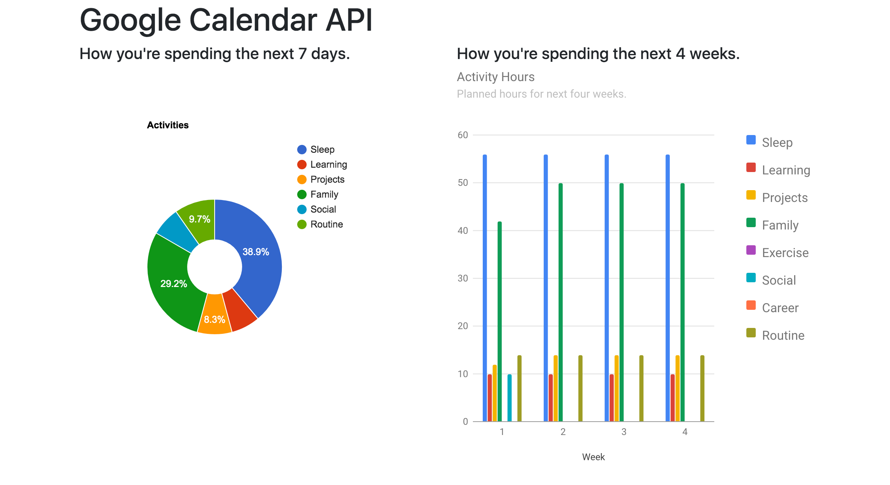

# google-calendar

Application to visualize your Google Calendar data.

## Screenshots



### Requirements

- Python3.6+
- pip3

### Setup and Installation

macOS / Linux Command Line

```
git clone https://github.com/itzliu/google-calendar.git
cd google-calendar
python -m venv venv
source venv/bin/activate
pip install -r requirements.txt
python run.py
```

Windows Command Line

```
git clone https://github.com/itzliu/google-calendar.git.
cd google-calendar
python -m venv venv
source venv/Scripts/activate
pip install -r requirements.txt
python run.py
```

## Built With

- Flask Framework
- Google Calendar API
- Google Charts API
